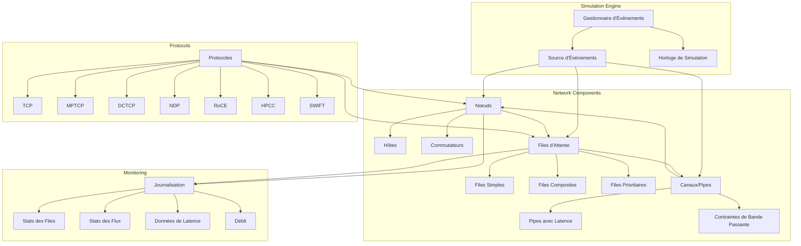
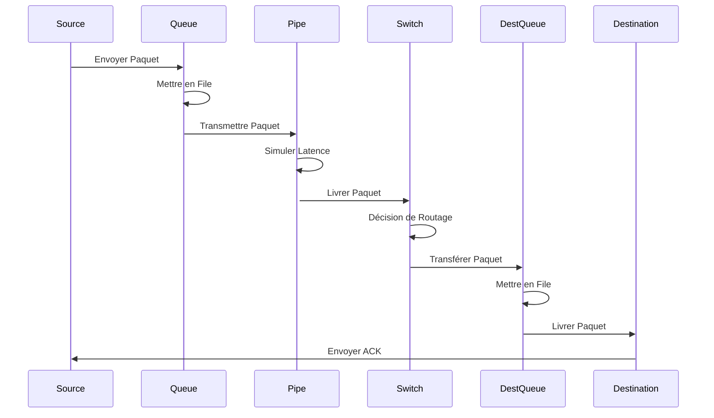
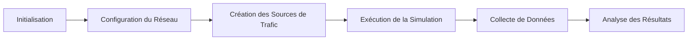

# Aperçu de l'Architecture de HTSIM

## Architecture Générale

HTSIM adopte une architecture modulaire basée sur les événements discrets. Cette conception permet une simulation efficace de grands réseaux tout en maintenant une séparation claire des responsabilités entre les différents composants.

## Composants Architecturaux Clés

## Principe de Fonctionnement

HTSIM fonctionne selon le principe de simulation à événements discrets. Au lieu de simuler le temps de manière continue, le système avance d'un événement à l'autre par sauts discrets.

### 1. Moteur de Simulation d'Événements Discrets

Le cœur de HTSIM est son moteur de simulation d'événements discrets, qui :

- Maintient une file d'événements ordonnée par temps d'occurrence
- Exécute séquentiellement les événements dans l'ordre chronologique
- Met à jour l'horloge de simulation à chaque nouvel événement
- Génère de nouveaux événements en réaction aux événements actuels

Ce modèle permet une simulation efficace de longues périodes de temps réseau sans gaspiller de ressources de calcul pendant les périodes d'inactivité.

### 2. Flux de Données dans la Simulation

### 3. Organisation des Composants

HTSIM est structuré autour de plusieurs classes C++ fondamentales :

| Composant             | Description                                             | Responsabilité Principale                                                           |
|-----------------------|---------------------------------------------------------|------------------------------------------------------------------------------------|
| `EventSource`         | Base pour tout ce qui génère des événements             | Produire des événements à traiter par le simulateur                                 |
| `PacketSink`          | Interface pour recevoir des paquets                     | Définir comment les composants reçoivent et traitent les paquets                    |
| `BaseQueue`           | Classe de base pour toutes les files d'attente          | Stocker temporairement les paquets et gérer la congestion                           |
| `Pipe`                | Modélise les liens de transmission                      | Simuler la latence et les contraintes de bande passante                             |
| `Switch`              | Modélise les commutateurs réseau                        | Prendre des décisions de routage et transférer des paquets                          |
| `Logger`              | Capture les métriques de la simulation                  | Enregistrer et analyser les données de performance                                  |
| `Protocol Endpoints`  | Points de terminaison des protocoles (TCP, NDP, etc.)   | Implémenter la logique spécifique au protocole (contrôle de débit, retransmission)  |

## Cycle de Vie d'une Simulation

1. **Initialisation** : Le moteur de simulation est initialisé avec les paramètres de base.
2. **Configuration du Réseau** : La topologie, les capacités des liens et les tampons sont configurés.
3. **Création des Sources de Trafic** : Les modèles de trafic et les protocoles sont configurés.
4. **Exécution de la Simulation** : Le moteur traite les événements jusqu'à atteindre le temps de fin.
5. **Collecte de Données** : Les métriques et statistiques sont enregistrées pendant la simulation.
6. **Analyse des Résultats** : Les données collectées sont analysées pour évaluer les performances.

## Modèle d'Extension

HTSIM est conçu pour être facilement extensible. De nouveaux composants peuvent être ajoutés en :

- Créant des sous-classes des classes de base existantes
- Implémentant les interfaces requises (comme `PacketSink` ou `EventSource`)
- S'intégrant avec le système d'événements discrets

Cette approche modulaire permet d'ajouter de nouveaux protocoles, mécanismes de contrôle de congestion, ou topologies réseau sans avoir à modifier le cœur du simulateur.
