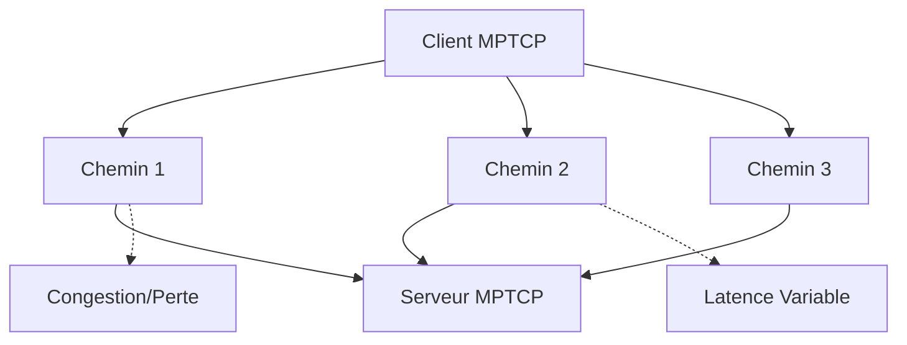
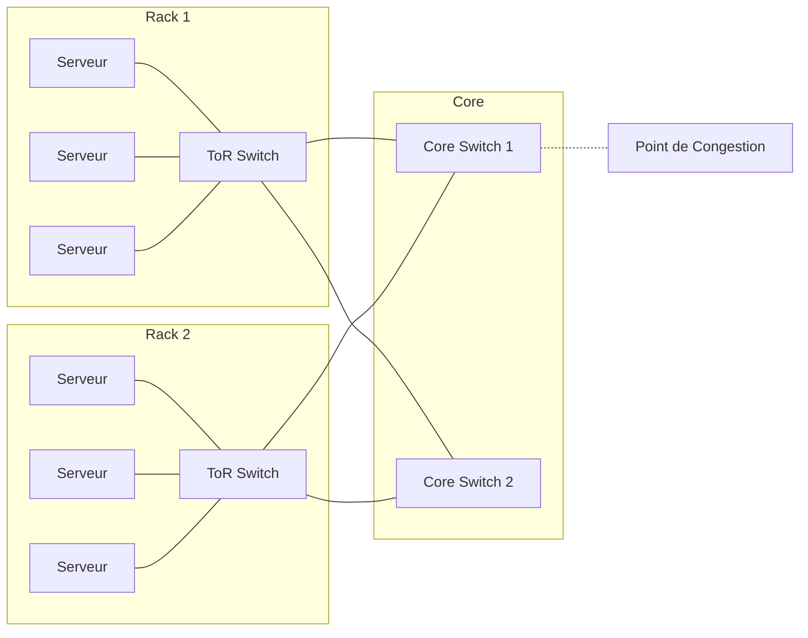

# Cas d'Utilisation de HTSIM

## Domaines d'Application Principaux

HTSIM est un outil polyvalent qui trouve son utilité dans de nombreux domaines de la recherche et de l'ingénierie réseau. Voici les principaux cas d'utilisation du simulateur :

### 1. Recherche Académique

HTSIM est largement utilisé dans le milieu académique pour :
- L'évaluation et la comparaison de nouvelles méthodes de contrôle de congestion
- L'étude du comportement de protocoles réseau dans diverses conditions
- La validation de modèles théoriques et mathématiques de comportement réseau
- La formation aux concepts avancés de réseaux informatiques

### 2. Test et Développement de Protocoles Réseau

HTSIM permet de tester rapidement de nouveaux protocoles avant leur implémentation matérielle :
- Développement et test du protocole NDP (Network Datacenter Protocol)
- Évaluation du comportement de MPTCP (Multipath TCP) dans divers environnements
- Analyse comparative de DCTCP, DCQCN et d'autres protocoles de centre de données
- Expérimentation avec RoCE, PFC, Swift et HPCC dans un environnement contrôlé

### 3. Optimisation des Réseaux de Centres de Données

L'un des domaines où HTSIM excelle particulièrement :
- Évaluation de différentes topologies de centres de données (Fat-Tree, Leaf-Spine, etc.)
- Test de l'impact des pannes sur la performance du réseau
- Optimisation du placement des machines virtuelles pour minimiser la congestion
- Étude des effets des trafics incast et outcast sur les performances réseau

### 4. Test de Gestion de Congestion pour BXI

Un cas d'utilisation spécifique et important de HTSIM est le test des mécanismes de contrôle de congestion pour l'interconnexion BXI (Bull eXascale Interconnect) :
- Simulation de topologies à grande échelle représentatives des déploiements HPC
- Analyse de la performance des algorithmes de routage dans des conditions de charge variées
- Évaluation de l'efficacité des mécanismes de contrôle de flux sous forte charge
- Identification des goulots d'étranglement potentiels dans les configurations BXI

### 5. Planification de Capacité Réseau

HTSIM aide les ingénieurs réseau à :
- Dimensionner correctement les liens et les équipements réseau
- Prédire les performances sous charge croissante
- Déterminer les points de défaillance potentiels
- Planifier les extensions de capacité de manière optimale

### 6. Éducation et Formation

Le simulateur sert également d'outil pédagogique pour :
- Illustrer des concepts de réseau complexes à des étudiants
- Permettre des expériences pratiques sans nécessiter d'équipement coûteux
- Visualiser le comportement des protocoles et des algorithmes de contrôle de congestion
- Comparer différentes approches de conception réseau

## Exemples Concrets

### Exemple 1 : Évaluation de Multipath TCP

HTSIM a été utilisé pour évaluer les performances de MPTCP dans divers scénarios :

Les chercheurs ont pu analyser comment MPTCP répartit le trafic entre plusieurs chemins et comment il réagit aux variations de conditions réseau sur chaque chemin.

### Exemple 2 : Optimisation de Topologie Fat-Tree pour Centres de Données

HTSIM a permis de comparer différentes variantes de la topologie Fat-Tree :

| Variante | Surprovisionnement | Nombre de Commutateurs | Performance sous Trafic All-to-All | Résilience aux Pannes |
|----------|--------------------|-----------------------|-----------------------------------|----------------------|
| 1:1      | Aucun              | Minimal               | Excellente                        | Moyenne              |
| 2:1      | Modéré             | Moyen                 | Très bonne                        | Bonne                |
| 4:1      | Élevé              | Élevé                 | Bonne                             | Excellente           |

### Exemple 3 : Test de Congestion à Grande Échelle

Dans un scénario où des centaines de serveurs communiquent simultanément (pattern many-to-many), HTSIM a permis d'identifier des problèmes de performances qui n'auraient pas été visibles dans des tests à petite échelle.

