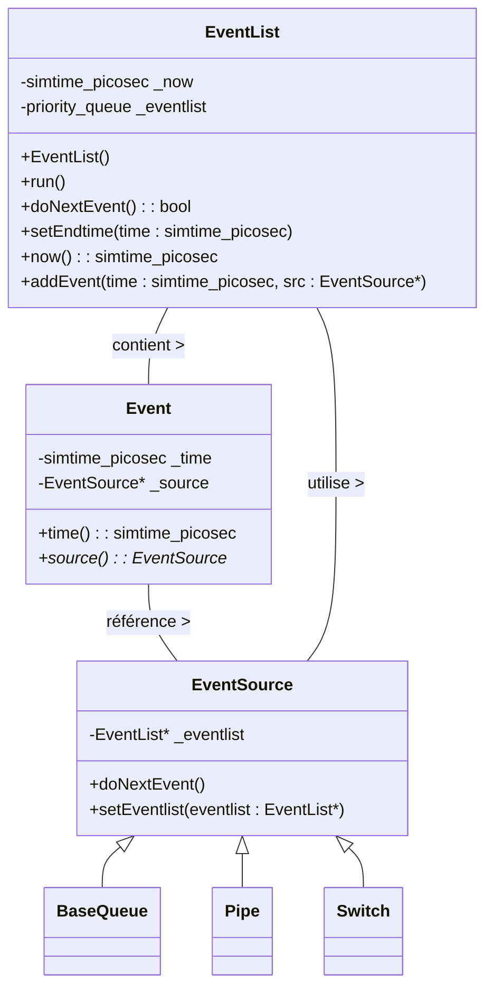
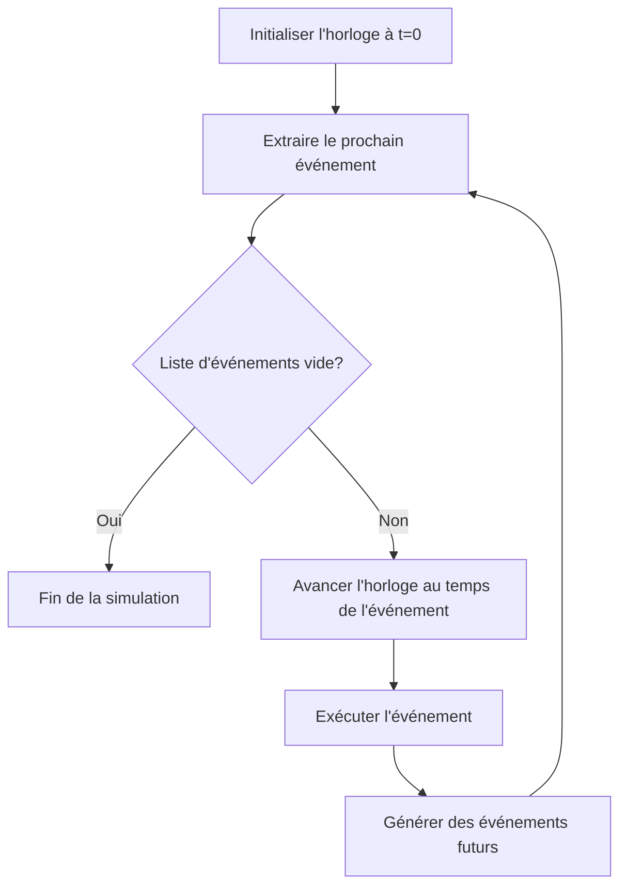

# Ordonnanceur d'Événements dans HTSIM

## Introduction

L'Ordonnanceur d'Événements (Event Scheduler) est le cœur du moteur de simulation à événements discrets de HTSIM. Il gère l'horloge de simulation, ordonne les événements par temps d'occurrence et assure leur exécution séquentielle dans le bon ordre chronologique. Ce composant est essentiel pour garantir la précision temporelle et la cohérence causale de la simulation.

## Principes Fondamentaux

### Simulation à Événements Discrets

HTSIM est basé sur le paradigme de simulation à événements discrets (DES - Discrete Event Simulation), qui présente plusieurs avantages pour la simulation réseau :

- **Efficacité** : Les ressources de calcul sont consacrées uniquement aux moments où le système change d'état
- **Précision** : Les événements sont traités dans un ordre strictement chronologique
- **Déterminisme** : Pour une même séquence d'entrées, la simulation produira toujours les mêmes résultats

### Structure de Base



## Fonctionnement de l'Ordonnanceur

### Modèle Temporel

HTSIM utilise une représentation du temps en picosecondes (10^-12 secondes) pour permettre une simulation précise des réseaux haute performance :

```cpp
// Définition du type pour le temps de simulation
typedef uint64_t simtime_picosec;

// Constantes de conversion courantes
const simtime_picosec PICOSEC = 1ULL;
const simtime_picosec NANOSEC = 1000ULL;
const simtime_picosec MICROSEC = 1000000ULL;
const simtime_picosec MILLISEC = 1000000000ULL;
const simtime_picosec SECOND = 1000000000000ULL;
```

### Cycle d'Exécution Principal

Le cœur de l'ordonnanceur est sa boucle principale qui avance la simulation d'un événement à la fois :



Implémentation typique de cette boucle principale :

```cpp
bool EventList::run() {
    while (!_eventlist.empty()) {
        if (_endt && _eventlist.top()->time() > _endt)
            return true;
            
        if (!doNextEvent())
            return false;
    }
    return true;
}

bool EventList::doNextEvent() {
    if (_eventlist.empty())
        return false;
        
    Event* next_event = _eventlist.top();
    _eventlist.pop();
    
    _now = next_event->time();
    
    EventSource* src = next_event->source();
    delete next_event;
    
    src->doNextEvent();
    return true;
}
```

### Planification d'Événements

Les événements sont ajoutés à l'ordonnanceur avec un temps d'occurrence futur :

```cpp
void EventList::addEvent(simtime_picosec time, EventSource* src) {
    _eventlist.push(new Event(time, src));
}
```

Les composants réseau planifient des événements lorsqu'ils ont besoin d'exécuter une action à un moment précis dans le futur :

```cpp
// Exemple : un Pipe planifiant la livraison d'un paquet
void Pipe::receivePacket(Packet& pkt) {
    // Calculer le temps de livraison
    simtime_picosec delivery_time = _eventlist->now() + _delay;
    
    // Stocker le paquet pour livraison ultérieure
    _packets_in_transit.push_back(std::make_pair(delivery_time, &pkt));
    
    // Planifier un événement pour livrer le paquet
    _eventlist->addEvent(delivery_time, this);
}
```

## Caractéristiques Avancées

### Gestion de la Priorité des Événements

HTSIM permet d'attribuer des priorités aux événements pour résoudre les ambiguïtés temporelles :

```cpp
class Event {
private:
    simtime_picosec _time;
    EventSource* _source;
    int _priority;
    
public:
    Event(simtime_picosec time, EventSource* src, int prio = 0)
        : _time(time), _source(src), _priority(prio) {}
        
    bool operator<(const Event& other) const {
        if (_time != other._time)
            return _time > other._time;  // Ordre croissant de temps
        return _priority < other._priority;  // À temps égal, priorité décroissante
    }
};
```

### Événements Récurrents

Pour les événements qui se répètent périodiquement, comme l'échantillonnage de statistiques :

```cpp
// Exemple d'un échantillonneur périodique
class PeriodicSampler : public EventSource {
private:
    simtime_picosec _period;
    
public:
    PeriodicSampler(simtime_picosec period) : _period(period) {}
    
    void start() {
        // Planifier le premier échantillonnage
        _eventlist->addEvent(_eventlist->now() + _period, this);
    }
    
    void doNextEvent() {
        // Effectuer l'échantillonnage
        takeSample();
        
        // Planifier le prochain échantillonnage
        _eventlist->addEvent(_eventlist->now() + _period, this);
    }
    
    void takeSample() {
        // Logique d'échantillonnage...
    }
};
```

### Interruption et Reprise de Simulation

HTSIM peut interrompre et reprendre la simulation, ce qui est utile pour les analyses intermédiaires :

```cpp
// Interrompre la simulation après un certain temps
eventlist.setEndtime(eventlist.now() + SECOND * 10);  // Exécuter pendant 10s
eventlist.run();

// Analyser les résultats intermédiaires
analyze_intermediate_results();

// Reprendre la simulation
eventlist.setEndtime(eventlist.now() + SECOND * 10);  // 10s supplémentaires
eventlist.run();
```

## Événements dans les Composants Réseau

### Événements dans les Files d'Attente

Les files d'attente planifient des événements pour le service des paquets :

```cpp
void Queue::beginService() {
    if (_queue.empty())
        return;
        
    Packet* pkt = _queue.front();
    
    // Calculer le temps de service basé sur la taille du paquet
    simtime_picosec service_time = pkt->size() * 8 / _bitrate;
    
    // Planifier la fin du service
    _eventlist->addEvent(_eventlist->now() + service_time, this);
}

void Queue::doNextEvent() {
    // Le paquet a terminé son service
    Packet* pkt = _queue.front();
    _queue.pop_front();
    
    // Transmettre le paquet à la destination
    _destination->receivePacket(*pkt);
    
    // Commencer le service du paquet suivant
    beginService();
}
```

### Événements dans les Canaux de Transmission (Pipes)

Les pipes utilisent des événements pour modéliser la latence de propagation :

```cpp
void Pipe::doNextEvent() {
    // Trouver tous les paquets qui doivent être livrés maintenant
    simtime_picosec now = _eventlist->now();
    
    while (!_packets_in_transit.empty() && 
           _packets_in_transit.front().first <= now) {
        
        Packet* pkt = _packets_in_transit.front().second;
        _packets_in_transit.pop_front();
        
        // Livrer le paquet
        _destination->receivePacket(*pkt);
    }
    
    // Planifier le prochain événement si nécessaire
    if (!_packets_in_transit.empty()) {
        _eventlist->addEvent(_packets_in_transit.front().first, this);
    }
}
```

### Événements dans les Protocoles

Les protocoles de transport comme TCP utilisent des événements pour les retransmissions et autres mécanismes temporels :

```cpp
void TcpSrc::scheduleRetransmissionTimeout() {
    // Annuler le précédent timeout s'il existe
    if (_retransmit_timer_event)
        _eventlist->cancelEvent(_retransmit_timer_event);
    
    // Calculer le nouveau RTO basé sur les mesures RTT
    simtime_picosec rto = calculateRTO();
    
    // Planifier un nouvel événement de timeout
    _retransmit_timer_event = _eventlist->addEvent(_eventlist->now() + rto, this);
}
```

## Optimisations de Performance

### Structure de Données Efficace

La file de priorité standard utilisée par HTSIM peut être optimisée pour les cas spécifiques :

```cpp
// Utiliser un calendrier pour les événements regroupés par temps
class CalendarQueue {
private:
    vector<list<Event*>> _buckets;
    size_t _bucket_count;
    simtime_picosec _bucket_width;
    
public:
    // Opérations adaptées pour une meilleure efficacité avec
    // des distributions d'événements typiques en simulation réseau
};
```

### Regroupement d'Événements

Pour les simulations à très grande échelle, le regroupement d'événements similaires peut améliorer considérablement les performances :

```cpp
// Exemple de regroupement d'événements pour un grand nombre de flux similaires
class BatchedEvents : public EventSource {
private:
    vector<EventInfo> _batched_events;
    
public:
    void doNextEvent() {
        // Traiter tous les événements du groupe en une seule fois
        for (auto& event_info : _batched_events) {
            // Traiter chaque événement
        }
    }
};
```

### Parallélisation Limitée

Bien que HTSIM soit principalement séquentiel, certains aspects peuvent être parallélisés :

```cpp
// Parallélisation du traitement statistique sans affecter la simulation
void processBatchedStatistics() {
    #pragma omp parallel for
    for (int i = 0; i < _stat_batches.size(); i++) {
        _stat_batches[i].process();
    }
}
```

## Débogage et Surveillance

### Journalisation des Événements

Pour le débogage, HTSIM peut enregistrer les événements traités :

```cpp
bool EventList::doNextEvent() {
    if (_eventlist.empty())
        return false;
        
    Event* next_event = _eventlist.top();
    _eventlist.pop();
    
    _now = next_event->time();
    
    if (_log_events) {
        _log << "Event: time=" << (_now / NANOSEC) << "ns, "
             << "src=" << typeid(*(next_event->source())).name() << endl;
    }
    
    EventSource* src = next_event->source();
    delete next_event;
    
    src->doNextEvent();
    return true;
}
```

### Vérification de Cohérence

Pour assurer l'intégrité de la simulation :

```cpp
void EventList::addEvent(simtime_picosec time, EventSource* src) {
    // Vérifier que le temps est cohérent (pas dans le passé)
    assert(time >= _now);
    
    _eventlist.push(new Event(time, src));
}
```

## Bonnes Pratiques

### Considérations d'Efficacité

1. **Minimiser le nombre d'événements** : Combiner les événements logiquement liés quand c'est possible
2. **Éviter les dépendances circulaires** : S'assurer que les événements à temps égal sont traités dans un ordre logique
3. **Prioriser correctement** : Utiliser le système de priorité pour résoudre les ambiguïtés temporelles
4. **Estimation préalable** : Estimer le nombre d'événements pour dimensionner les structures de données

### Précision Temporelle

1. **Cohérence des unités** : Utiliser systématiquement les constantes temporelles (SECOND, MILLISEC, etc.)
2. **Attention aux arrondis** : Les calculs impliquant le temps doivent préserver la précision
3. **Ordre causal** : Les événements causalement liés doivent respecter un ordre strict

## Extension de l'Ordonnanceur

### Création d'un Ordonnanceur Personnalisé

Pour des besoins spécifiques, vous pouvez étendre l'ordonnanceur standard :

```cpp
class MyCustomEventList : public EventList {
private:
    // Fonctionnalités personnalisées
    
public:
    // Surcharger les méthodes nécessaires
    virtual bool doNextEvent() override {
        // Logique personnalisée avant l'exécution
        bool result = EventList::doNextEvent();
        // Logique personnalisée après l'exécution
        return result;
    }
    
    // Ajouter de nouvelles fonctionnalités
    void pauseAt(simtime_picosec time) {
        // Logique pour suspendre la simulation à un moment précis
    }
};
```

### Intégration avec des Sources d'Événements Externes

Pour des simulations hybrides ou co-simulations :

```cpp
class ExternalEventSource : public EventSource {
private:
    ExternalSystem* _ext_system;
    
public:
    void checkExternalEvents() {
        // Vérifier si des événements externes sont disponibles
        if (_ext_system->hasEvents()) {
            ExternalEvent ext_event = _ext_system->getNextEvent();
            
            // Convertir en événement HTSIM
            _eventlist->addEvent(_eventlist->now() + 
                                 convertExternalTime(ext_event.time), this);
        }
    }
    
    void doNextEvent() {
        // Traiter l'événement externe
        // ...
        
        // Vérifier les prochains événements externes
        checkExternalEvents();
    }
};
```

## Conclusion

L'Ordonnanceur d'Événements est le moteur central de HTSIM, orchestrant l'exécution ordonnée des événements qui collectivement simulent le comportement d'un réseau. Sa conception efficace est cruciale pour les performances globales du simulateur, particulièrement pour les simulations à grande échelle.

La compréhension de son fonctionnement est essentielle tant pour l'utilisation efficace de HTSIM que pour le développement d'extensions ou de composants personnalisés. Les principes de simulation à événements discrets appliqués ici sont également fondamentaux dans d'autres domaines de simulation, rendant cette connaissance précieuse au-delà de HTSIM.
