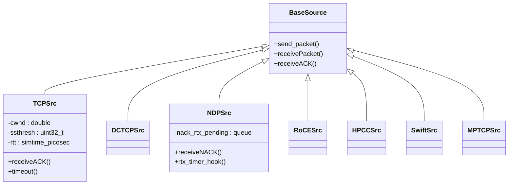
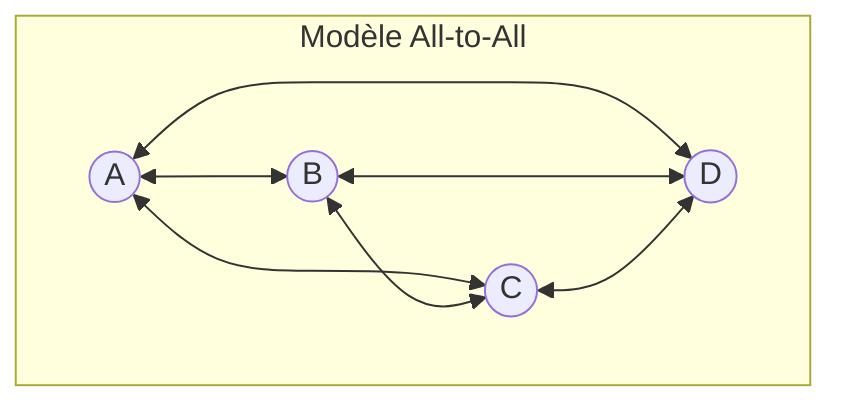
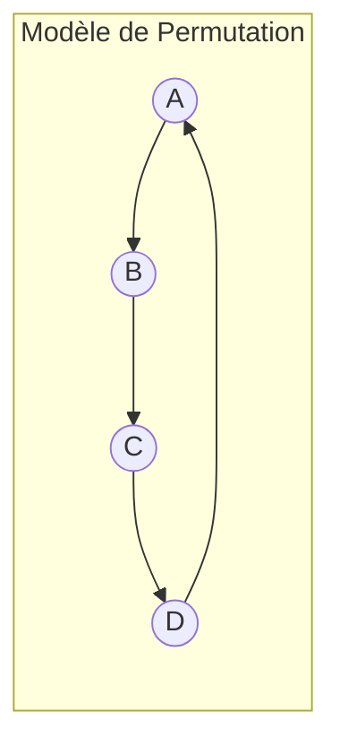
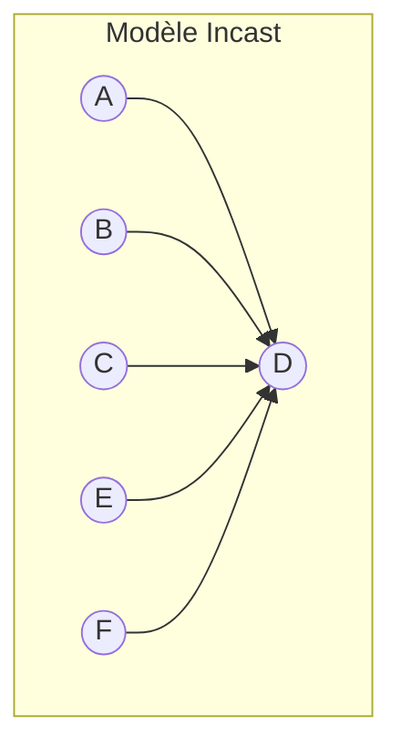
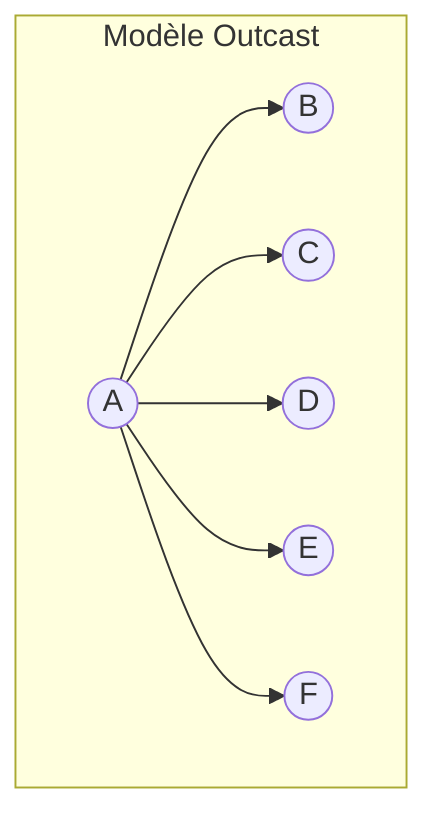

# Modèles de Flux et de Trafic dans HTSIM

## Vue d'ensemble

Les modèles de flux et de trafic dans HTSIM définissent comment les données circulent à travers le réseau simulé. Ces modèles sont essentiels pour représenter de manière réaliste les charges de travail des applications réseau et pour tester le comportement des mécanismes de contrôle de congestion dans diverses conditions.

## Modèles de Flux

Un flux dans HTSIM représente une séquence de paquets entre une source et une destination. Les flux sont généralement contrôlés par des protocoles de transport comme TCP, MPTCP ou des protocoles personnalisés.

### Types de Flux Disponibles



#### TCP (Transmission Control Protocol)

Le modèle TCP standard dans HTSIM implémente les principales fonctionnalités de TCP :
- Contrôle de congestion (augmentation lente, évitement de congestion)
- Fenêtre d'envoi (CWND)
- Retransmission basée sur les temporisateurs
- Fast retransmit et fast recovery

#### DCTCP (Data Center TCP)

DCTCP est une variante de TCP conçue spécifiquement pour les environnements de centre de données :
- Utilisation de la notification de congestion explicite (ECN)
- Réponse proportionnelle à la congestion basée sur la fraction de paquets marqués ECN
- Meilleure performance pour les applications sensibles à la latence

#### NDP (NDP Datacenter Protocol)

NDP est un protocole développé en utilisant HTSIM qui améliore les performances dans les réseaux de centre de données :
- Trimming (réduction) des paquets au lieu de les rejeter entièrement
- NACKs (accusés de réception négatifs) pour la retransmission rapide
- Pull-based congestion control (contrôle de congestion basé sur l'attraction)

#### RoCE (RDMA over Converged Ethernet)

Le modèle RoCE dans HTSIM implémente RDMA sur Ethernet :
- Transfert de données sans intervention du CPU
- Basé sur les crédits pour le contrôle de flux
- Souvent combiné avec PFC (Priority Flow Control) pour éviter les pertes

#### HPCC (High Precision Congestion Control)

HPCC est un algorithme de contrôle de congestion avancé :
- Utilise des informations précises sur l'état de la file d'attente
- Réponse rapide aux changements de congestion
- Bonne performance dans les réseaux haute vitesse

#### Swift

Swift est un algorithme de contrôle de congestion moderne :
- Délai et débit combinés pour les décisions de contrôle
- Convergence rapide vers un partage équitable
- Bonne tolérance à la diversité des RTT

#### MPTCP (MultiPath TCP)

MPTCP permet d'utiliser plusieurs chemins réseau simultanément :
- Distribution du trafic sur plusieurs sous-flux
- Équilibrage de charge et tolérance aux pannes
- Couplage entre sous-flux pour l'équité avec les flux TCP classiques

## Modèles de Trafic

Les modèles de trafic définissent les patterns selon lesquels les flux sont créés et distribués dans le réseau.

### Patterns de Communication

#### All-to-All

Chaque nœud communique avec tous les autres nœuds du réseau, créant une matrice complète de flux.



**Cas d'utilisation** : Analyse de performance du réseau sous charge maximale, simulation d'applications de calcul distribué.

#### Permutation

Chaque nœud communique avec exactement un autre nœud, créant un mappage unique source-destination.



**Cas d'utilisation** : Évaluation de l'équité et des performances dans les communications point à point.

#### Incast

De nombreux nœuds envoient simultanément des données vers un seul nœud destinataire.



**Cas d'utilisation** : Simulation des goulots d'étranglement dans les architectures client-serveur, tests de contrôle de congestion dans les scénarios many-to-one.

#### Outcast

Un seul nœud envoie des données à de nombreux destinataires simultanément.



**Cas d'utilisation** : Évaluation des performances de diffusion de données, simulation des applications de streaming.

### Distributions Temporelles

Les flux peuvent être générés selon différentes distributions temporelles :

#### Distribution Constante
Les flux sont créés à intervalles réguliers.

#### Distribution Poisson
Les arrivées de flux suivent une distribution de Poisson, modélisant des arrivées aléatoires indépendantes.

#### Distribution Pareto
Utilisée pour modéliser le trafic en rafale avec une forte variabilité.

### Distributions de Taille

Les tailles de flux peuvent également suivre différentes distributions :

#### Taille Fixe
Tous les flux ont la même taille.

#### Distribution Uniforme
Les tailles de flux sont réparties uniformément entre une valeur minimale et maximale.

#### Distribution Exponentielle
Modélise des flux avec de nombreux transferts courts et quelques transferts longs.

#### Distribution Pareto
Reproduit les caractéristiques observées dans le trafic Internet réel, avec une longue queue (heavytail).

## Configuration des Modèles de Trafic

HTSIM permet de configurer précisément les modèles de trafic pour les simulations :

### Exemple de Configuration de Trafic

```cpp
// Créer un générateur de trafic selon une distribution de Poisson
PoissonTrafficGenerator* tg = new PoissonTrafficGenerator(mean_flow_arrival_rate);

// Définir la distribution de taille des flux (ici une distribution Pareto)
tg->setFlowSizeDistribution(new ParetoFlowSizeDistribution(mean_size, shape));

// Définir le pattern de communication (ici all-to-all)
tg->setPattern(TRAFFIC_PATTERN_ALL_TO_ALL);

// Définir le type de flux à générer
tg->setFlowType(FLOW_TYPE_TCP);

// Lancer la génération de trafic
tg->start();
```

## Tableau Comparatif des Modèles de Flux

| Modèle | Contrôle de Congestion | Prévention de Perte | Sensibilité au RTT | Cas d'Utilisation Typique |
|--------|------------------------|---------------------|-------------------|---------------------------|
| TCP | AIMD (Additive Increase, Multiplicative Decrease) | Rejet | Élevée | Internet général, transferts fiables |
| DCTCP | Proportionnel aux marquages ECN | ECN | Moyenne | Applications de centre de données |
| NDP | Pull-based | Trimming + Retransmission rapide | Faible | Workloads sensibles à la latence |
| RoCE | Basé sur les crédits | PFC | Très faible | Applications HPC, stockage |
| HPCC | Basé sur la charge et la capacité | INT (In-band Network Telemetry) | Faible | Réseaux haute vitesse |
| Swift | Hybride délai-débit | ECN | Moyenne | Réseaux modernes à haute vitesse |
| MPTCP | AIMD couplé | Comme TCP | Variable | Environnements multi-chemins |

## Métriques d'Évaluation

Pour évaluer les performances des modèles de flux et de trafic, HTSIM permet de mesurer diverses métriques :

### Métriques de Performance

| Métrique | Description | Importance |
|----------|-------------|------------|
| Débit | Quantité de données transmises par unité de temps | Indique l'efficacité d'utilisation de la bande passante |
| Latence | Temps pour qu'un paquet voyage de la source à la destination | Critique pour les applications interactives |
| Taux de perte | Pourcentage de paquets perdus ou rejetés | Indique le niveau de congestion |
| Fairness Index | Mesure de l'équité dans la répartition des ressources | Indique si les flux reçoivent une part équitable |
| Queue Occupancy | Niveau de remplissage des files d'attente | Indique le niveau de tamponnage dans le réseau |
| Flow Completion Time (FCT) | Temps pour terminer un transfert complet | Important pour les performances applicatives |

## Bonnes Pratiques

### Pour la Simulation de Flux

- **Choisir le bon modèle** : Sélectionner le modèle de flux qui correspond le mieux au scénario réel que vous souhaitez simuler
- **Calibrer les paramètres** : Ajuster les paramètres du protocole pour refléter des configurations réalistes
- **Varier les tailles de flux** : Tester avec différentes tailles pour évaluer la sensibilité du système

### Pour la Génération de Trafic

- **Reproduire des charges réalistes** : Utiliser des distributions observées dans des environnements réels
- **Combiner différents modèles** : Mélanger plusieurs modèles de trafic pour représenter des scénarios complexes
- **Inclure la variabilité** : Introduire de la variabilité temporelle pour simuler des conditions changeantes
