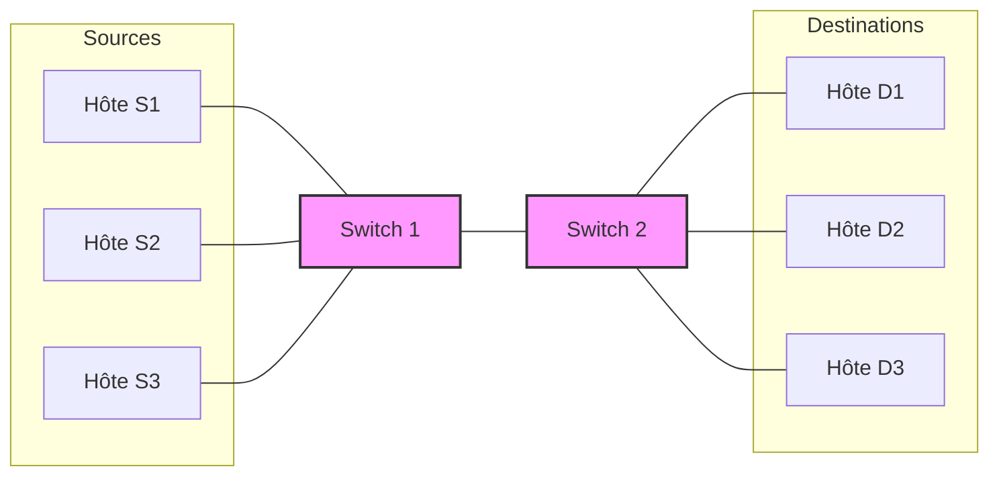
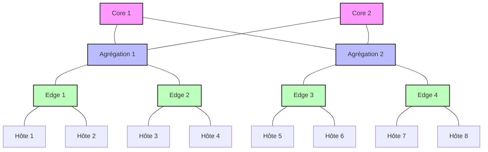
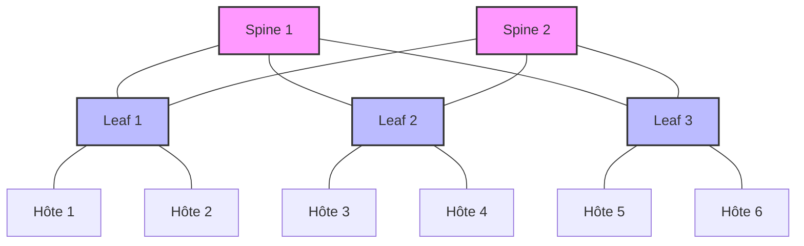
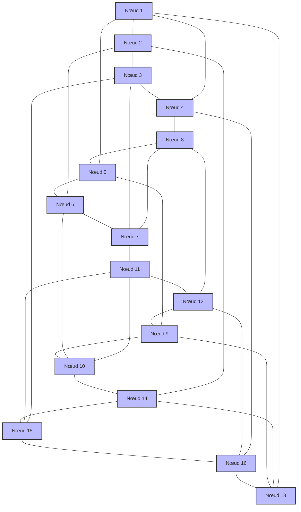

# Topologie de Réseau dans HTSIM

## Vue d'ensemble

La topologie de réseau définit comment les différents composants réseau (hôtes, commutateurs, routeurs) sont interconnectés dans une simulation HTSIM. La conception de la topologie est cruciale car elle détermine les chemins disponibles pour le trafic et influence directement les performances globales du réseau simulé.

## Concepts Fondamentaux

Une topologie dans HTSIM est construite en connectant des commutateurs, des hôtes et des liens (pipes) dans une configuration spécifique. Chaque topologie présente des caractéristiques distinctes qui la rendent adaptée à certains scénarios de simulation.

## Principales Topologies Prises en Charge

### Topologie Dumbbell (Haltère)



La topologie dumbbell est principalement utilisée pour étudier les goulots d'étranglement dans les réseaux. Elle consiste en deux groupes d'hôtes connectés par un lien central, créant un point de congestion naturel.

**Caractéristiques clés :**
- Un seul chemin entre chaque source et destination
- Congestion concentrée sur le lien central
- Utile pour tester le comportement des algorithmes de contrôle de congestion

### Topologie Fat-Tree



La topologie Fat-Tree est couramment utilisée dans les centres de données modernes. Elle offre une bande passante uniforme entre n'importe quelle paire d'hôtes et une excellente évolutivité.

**Caractéristiques clés :**
- Structure hiérarchique à trois niveaux (core, agrégation, edge)
- Plusieurs chemins entre chaque paire d'hôtes
- Aucun goulot d'étranglement de sursouscription (dans sa forme pure)
- Excellente tolérance aux pannes

### Topologie Leaf-Spine



La topologie Leaf-Spine est une architecture à deux niveaux populaire dans les centres de données modernes, offrant une faible latence et une haute bande passante.

**Caractéristiques clés :**
- Architecture à deux niveaux (spine et leaf)
- Chaque leaf est connecté à chaque spine
- Distance constante entre les hôtes (3 sauts maximum)
- Facilement extensible en ajoutant des commutateurs spine ou leaf

### Topologie en Tore



La topologie en tore est couramment utilisée dans les supercalculateurs et les environnements HPC (High-Performance Computing).

**Caractéristiques clés :**
- Structure en maille où les bords sont connectés pour former un tore
- Chemins multiples entre les nœuds
- Bonne évolutivité pour les applications HPC
- Routage simple et symétrique

## Comparaison des Topologies

| Topologie | Nombre de Sauts (Max) | Tolérance aux Pannes | Évolutivité | Cas d'Utilisation Typiques |
|-----------|----------------------|---------------------|-------------|---------------------------|
| Dumbbell | 3 | Faible | Faible | Tests de congestion, évaluation de TCP |
| Fat-Tree | log₄(n) | Excellente | Bonne | Centres de données à grande échelle |
| Leaf-Spine | 3 | Bonne | Moyenne | Centres de données de taille moyenne |
| Tore | √n | Excellente | Excellente | Clusters HPC, supercalculateurs |

## Création de Topologies dans HTSIM

Pour créer une topologie dans HTSIM, le processus général est le suivant :

1. Définir les nœuds (commutateurs et hôtes)
2. Créer les liens (pipes) entre les nœuds
3. Configurer les tables de routage
4. Définir les sources de trafic

### Exemple de Code pour une Topologie Dumbbell

```cpp
// Créer les commutateurs
Switch* sw1 = new Switch(4);  // 4 ports
Switch* sw2 = new Switch(4);  // 4 ports

// Créer les hôtes (sources et destinations)
for (int i = 0; i < 3; i++) {
    // Créer les hôtes sources
    TCPSrc* src = new TCPSrc(...);
    
    // Créer les files d'attente des hôtes sources
    Queue* src_queue = new Queue(hostSpeed, queueSize);
    src_queue->setDestination(sw1, i);
    
    // Créer les hôtes destinations
    TCPSink* dst = new TCPSink(...);
    
    // Créer les files d'attente des hôtes destinations
    Queue* dst_queue = new Queue(hostSpeed, queueSize);
    dst_queue->setDestination(dst);
    
    // Connecter les commutateurs aux hôtes destinations
    Pipe* pipe_sw2_dst = new Pipe(linkDelay, hostSpeed);
    pipe_sw2_dst->setDestination(dst_queue);
    sw2->setQueue(i, pipe_sw2_dst);
}

// Créer le lien du goulot d'étranglement entre les commutateurs
Queue* sw1_queue = new Queue(bottleneckSpeed, bottleneckQueueSize);
Pipe* pipe_sw1_sw2 = new Pipe(bottleneckDelay, bottleneckSpeed);
pipe_sw1_sw2->setDestination(sw2, 3);  // Connecter au port 3 de sw2
sw1_queue->setDestination(pipe_sw1_sw2);
sw1->setQueue(3, sw1_queue);  // Configurer le port 3 de sw1
```

### Exemple de Code pour une Topologie Fat-Tree

```cpp
// Paramètres de configuration
int k = 4;  // Nombre de pods (la taille du fat-tree est k^3/4 hôtes)
int numCores = k*k/4;
int numAggs = k*k/2;
int numEdges = k*k/2;
int numHosts = k*k*k/4;

// Créer les commutateurs core
vector<Switch*> coreSwitches(numCores);
for (int i = 0; i < numCores; i++) {
    coreSwitches[i] = new Switch(k);
}

// Créer les commutateurs d'agrégation
vector<Switch*> aggSwitches(numAggs);
for (int i = 0; i < numAggs; i++) {
    aggSwitches[i] = new Switch(k);
}

// Créer les commutateurs edge
vector<Switch*> edgeSwitches(numEdges);
for (int i = 0; i < numEdges; i++) {
    edgeSwitches[i] = new Switch(k);
}

// Créer les connexions...
// (Suite du code pour créer toutes les connexions et configurer le routage)
```

## Patrons de Trafic Courants

Pour évaluer le comportement du réseau sous différentes charges, HTSIM prend en charge divers patrons de trafic :

### All-to-All
Chaque hôte communique avec tous les autres hôtes, créant un trafic dense à travers la topologie.

### Permutation
Chaque hôte envoie du trafic à un seul autre hôte, créant un mappage un-à-un.

### Incast
De nombreux hôtes envoient simultanément du trafic à un seul hôte, créant un point chaud.

### Hot-Spot
Un ou plusieurs nœuds reçoivent significativement plus de trafic que les autres.

## Considérations pour la Conception de Topologies

Lors de la conception d'une topologie pour une simulation HTSIM, plusieurs facteurs doivent être pris en compte :

- **Objectif de la simulation** : Différentes topologies sont adaptées à différents scénarios de test
- **Échelle** : Certaines topologies sont plus efficaces à grande échelle
- **Routage** : La complexité du routage varie selon la topologie
- **Tolérance aux pannes** : Certaines topologies offrent une meilleure résilience
- **Équilibre de charge** : La capacité à distribuer le trafic uniformément

## Outils d'Analyse de Topologie

HTSIM fournit plusieurs outils pour analyser les propriétés des topologies de réseau :

- Calcul du diamètre du réseau (nombre maximum de sauts)
- Évaluation du nombre de chemins alternatifs
- Analyse des goulots d'étranglement potentiels
- Visualisation de la topologie et du flux de trafic

## Bonnes Pratiques

- **Commencer simple** : Débuter avec des topologies simples pour comprendre le comportement de base
- **Isoler les variables** : Modifier un seul aspect de la topologie à la fois pour des comparaisons significatives
- **Vérifier la connectivité** : S'assurer que tous les nœuds sont correctement connectés
- **Valider le routage** : Confirmer que les tables de routage sont correctement configurées
- **Tester la résilience** : Simuler des pannes pour évaluer la robustesse de la topologie
