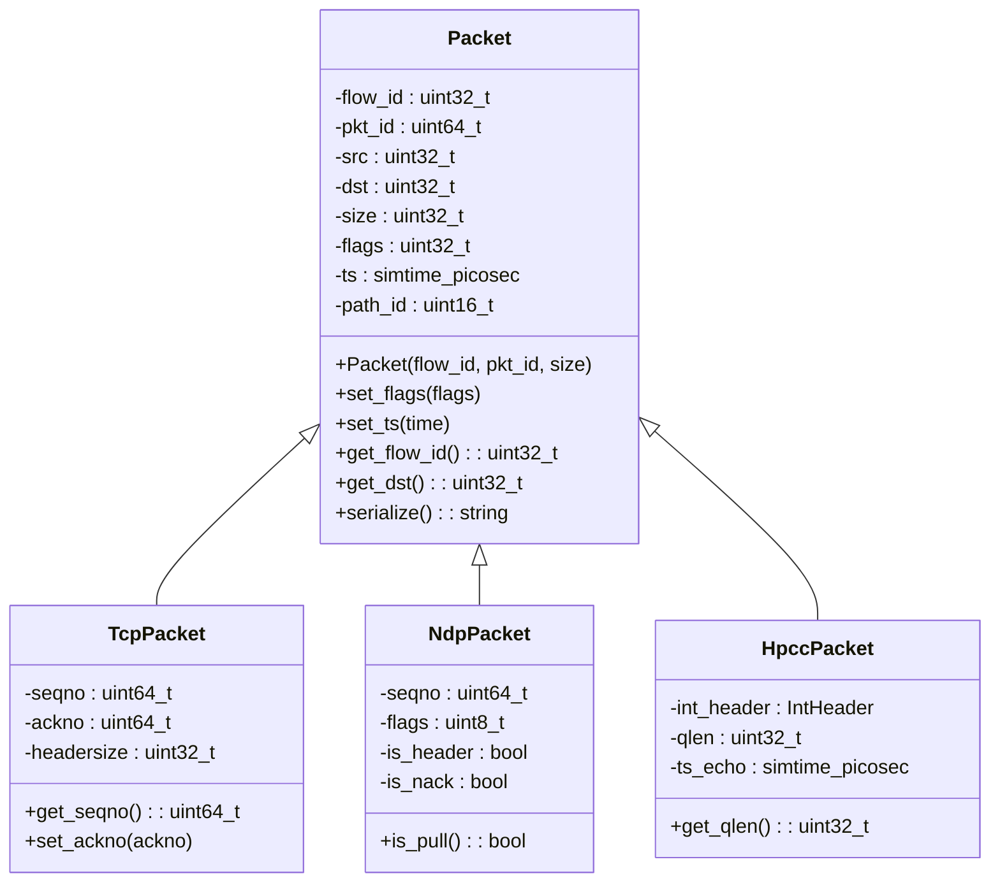
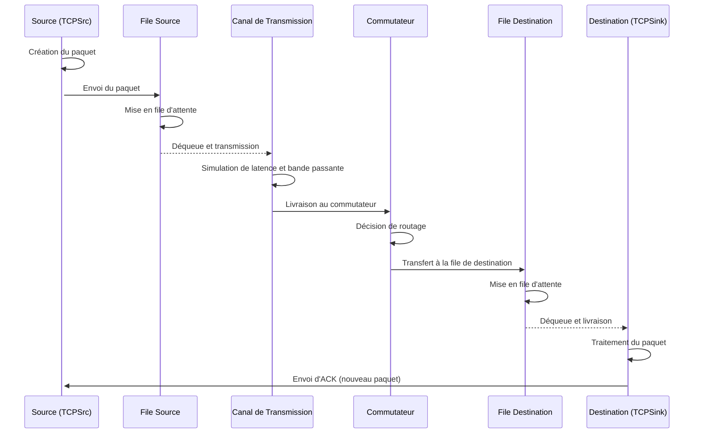

# Paquets dans HTSIM

## Vue d'ensemble

Les paquets sont l'unité de base de communication dans HTSIM, tout comme dans les réseaux réels. Ils représentent les données transmises entre les différents nœuds du réseau et sont manipulés par les composants de simulation comme les files d'attente, les canaux de transmission (pipes) et les commutateurs.

## Structure d'un Paquet



### Attributs Principaux d'un Paquet

| Attribut | Type | Description |
|----------|------|-------------|
| `flow_id` | uint32_t | Identifiant unique du flux auquel appartient le paquet |
| `pkt_id` | uint64_t | Identifiant unique du paquet au sein du flux |
| `src` | uint32_t | Adresse du nœud source |
| `dst` | uint32_t | Adresse du nœud destination |
| `size` | uint32_t | Taille du paquet en octets |
| `flags` | uint32_t | Drapeaux pour les marquages spéciaux (ECN, etc.) |
| `ts` | simtime_picosec | Horodatage indiquant quand le paquet a été créé |
| `path_id` | uint16_t | Identifiant du chemin (pour les protocoles multichemins) |

## Types de Paquets Spécialisés

HTSIM prend en charge différents types de paquets spécialisés pour les différents protocoles simulés :

### Paquets TCP

Les paquets TCP étendent la classe de base `Packet` avec des attributs spécifiques à TCP :

- `seqno` : Numéro de séquence du paquet
- `ackno` : Numéro d'accusé de réception
- `headersize` : Taille de l'en-tête TCP
- Drapeaux TCP : SYN, ACK, FIN, etc.

### Paquets NDP (NDP Datacenter Protocol)

Les paquets NDP incluent des attributs pour le contrôle de congestion pull-based :

- `seqno` : Numéro de séquence
- `is_header` : Indique si le paquet est un en-tête ou une charge utile
- `is_nack` : Indique un accusé de réception négatif
- `is_pull` : Indique un paquet pull demandant plus de données

### Paquets HPCC (High Precision Congestion Control)

Les paquets HPCC contiennent des informations de télémétrie réseau :

- `int_header` : En-tête de télémétrie en bande (INT)
- `qlen` : Longueur de file d'attente observée
- `ts_echo` : Horodatage écho pour le calcul RTT

## Cycle de Vie d'un Paquet



### 1. Création

Les paquets sont généralement créés par les sources de trafic comme `TCPSrc` :

```cpp
// Exemple simplifié de création de paquet
Packet* pkt = new TcpPacket(flow_id, next_pkt_id++, data_size);
pkt->set_ts(eventlist().now());
pkt->set_src(src_id);
pkt->set_dst(dst_id);
```

### 2. Transmission

Les paquets sont ensuite transmis à travers les composants réseau :

```cpp
// Envoi du paquet à la destination
_next_hop->receivePacket(*pkt);
```

### 3. Routage

Lors du passage par un commutateur, une décision de routage est prise :

```cpp
// Exemple simplifié de logique de routage
int output_port = route_table.lookup(pkt->get_dst());
_next_hops[output_port]->receivePacket(*pkt);
```

### 4. Mise en File d'Attente

Les paquets peuvent être mis en file d'attente lorsque le réseau est congestionné :

```cpp
// Exemple simplifié de mise en file d'attente
if (queuesize() + pkt->size() <= _maxsize) {
    _queue.push_back(pkt);
} else {
    // Rejet ou marquage ECN
}
```

### 5. Réception

Finalement, les paquets atteignent leur destination et sont traités :

```cpp
// Exemple simplifié de réception
void TCPSink::receivePacket(Packet& pkt) {
    TcpPacket* p = static_cast<TcpPacket*>(&pkt);
    // Traiter le paquet et envoyer un ACK
    sendAck(p->get_seqno());
}
```

## Manipulation des Paquets

### Marquage ECN

Le marquage ECN (Explicit Congestion Notification) est utilisé pour signaler la congestion sans rejeter les paquets :

```cpp
// Exemple de marquage ECN
if (queuesize() > _ecn_threshold) {
    pkt->set_flags(pkt->get_flags() | ECN_CE);
}
```

### Trimming de Paquets

Dans NDP, les paquets peuvent être "trimmed" (réduits à leur en-tête) lors de congestion :

```cpp
// Exemple de trimming
if (queuesize() > _maxsize) {
    if (p->is_header()) {
        // Conserver l'en-tête
        _queue.push_back(p);
    } else {
        // Trim la charge utile, conserver uniquement l'en-tête
        NdpPacket* header = p->trim_to_header();
        _queue.push_back(header);
        delete p;  // Libérer la mémoire du paquet original
    }
}
```

### Collecte de Statistiques

Les paquets sont utilisés pour collecter des statistiques réseau :

```cpp
// Exemple de collecte de statistiques
void receive_packet(Packet& pkt) {
    // Calcul du RTT
    simtime_picosec rtt = eventlist().now() - pkt.get_ts();
    _rtt_samples.push_back(rtt);
    
    // Enregistrement du débit
    _bytes_received += pkt.size();
}
```

## Sérialisation et Désérialisation

Dans certains cas, les paquets peuvent être sérialisés pour le logging ou l'analyse :

```cpp
// Exemple de sérialisation
string Packet::serialize() {
    stringstream ss;
    ss << "flow_id=" << _flow_id << ",pkt_id=" << _pkt_id 
       << ",size=" << _size << ",src=" << _src << ",dst=" << _dst;
    return ss.str();
}
```

## Optimisations

Pour améliorer les performances de simulation, plusieurs optimisations sont appliquées aux paquets :

### Réutilisation de Mémoire

Plutôt que de créer et détruire constamment des objets, HTSIM peut réutiliser les paquets :

```cpp
// Exemple de pool de paquets
class PacketPool {
private:
    queue<Packet*> _free_packets;
    
public:
    Packet* get_packet() {
        if (_free_packets.empty()) {
            return new Packet();
        } else {
            Packet* p = _free_packets.front();
            _free_packets.pop();
            return p;
        }
    }
    
    void free_packet(Packet* p) {
        p->reset();  // Réinitialiser l'état
        _free_packets.push(p);
    }
};
```

### Représentation Légère

Pour les très grandes simulations, une représentation plus légère peut être utilisée :

```cpp
// Structure légère pour les paquets nombreux
struct LightweightPacket {
    uint32_t flow_id : 24;
    uint32_t flags : 8;
    uint16_t size;
    uint16_t src;
    uint16_t dst;
    // Autres champs essentiels uniquement
};
```

## Extension du Système de Paquets

### Création d'un Nouveau Type de Paquet

Pour implémenter un nouveau protocole, vous pouvez créer un type de paquet personnalisé :

```cpp
// Exemple de paquet personnalisé
class MonProtocolePacket : public Packet {
private:
    // Attributs spécifiques à votre protocole
    uint32_t _mon_attribut;
    
public:
    MonProtocolePacket(uint32_t flow_id, uint64_t pkt_id, uint32_t size)
        : Packet(flow_id, pkt_id, size), _mon_attribut(0) {}
    
    void set_mon_attribut(uint32_t val) { _mon_attribut = val; }
    uint32_t get_mon_attribut() const { return _mon_attribut; }
};
```

## Considérations pour la Simulation

### Taille des Paquets

La taille des paquets affecte plusieurs aspects de la simulation :

- **Temps de transmission** : Temps = Taille / Bande passante
- **Occupation mémoire** : Impact sur les ressources nécessaires pour la simulation
- **Congestion** : Les grands paquets occupent plus d'espace dans les files d'attente

### Valeurs Typiques

| Type de Trafic | Taille Typique | Notes |
|----------------|----------------|-------|
| TCP général | 1500 octets | Taille MTU Ethernet standard |
| Petits paquets | 64-128 octets | ACKs, requêtes courtes |
| Jumbo frames | 9000 octets | Pour transferts haute performance |
| Paquets RDMA | 4096 octets | Commun dans les environnements HPC |

## Conclusion

Les paquets sont le fondement de toute simulation réseau dans HTSIM. Une bonne compréhension de leur structure, cycle de vie et manipulation est essentielle pour utiliser efficacement le simulateur et pour développer des extensions personnalisées.

L'architecture modulaire de HTSIM permet d'étendre facilement le système de paquets pour prendre en charge de nouveaux protocoles et fonctionnalités, tout en maintenant la haute performance qui est la marque de fabrique du simulateur.
