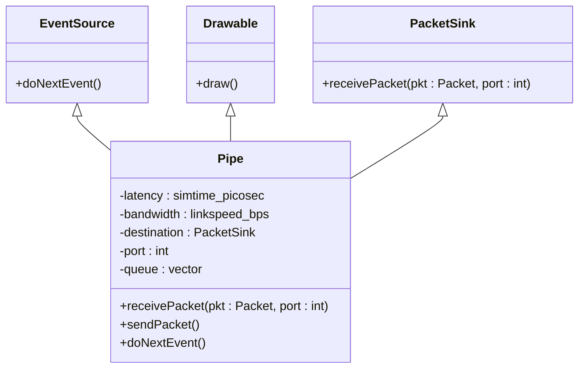
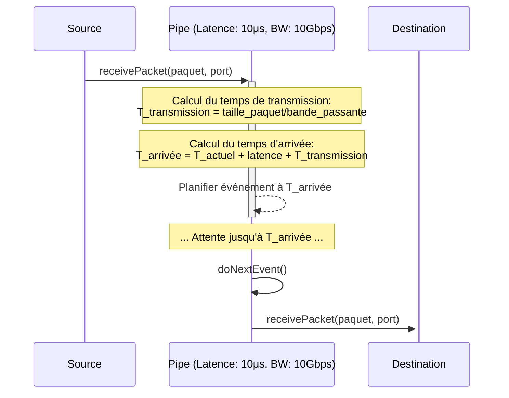
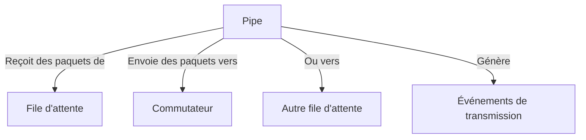

# Canaux de Transmission (Pipes) dans HTSIM

## Vue d'ensemble

Les Pipes (canaux de transmission) dans HTSIM sont des composants fondamentaux qui modélisent les liens physiques entre les nœuds du réseau. Ils permettent de simuler la latence et les contraintes de bande passante qui caractérisent les connexions réseau réelles.

## Définition et Objectif

Un Pipe dans HTSIM représente un lien de communication unidirectionnel entre deux points du réseau. Sa fonction principale est de modéliser deux caractéristiques essentielles des liens réseau :
- La **latence de propagation** (délai fixe pour qu'un signal traverse la distance physique)
- La **bande passante** (débit maximal du lien)

## Structure de la Classe Pipe



## Comment les Pipes Fonctionnent

### Modèle de Transmission

Le fonctionnement d'un Pipe est basé sur le modèle suivant :

1. Le Pipe reçoit un paquet de sa source (généralement une file d'attente ou un commutateur)
2. Le paquet est retardé pour simuler la latence de propagation
3. Le paquet est transmis à la destination à un débit limité par la bande passante du lien
4. Une fois la transmission terminée, le paquet est délivré à la destination du Pipe

Ce processus est illustré dans le diagramme suivant :



### Gestion du Temps

Les Pipes jouent un rôle crucial dans la simulation temporelle de HTSIM :
- Ils génèrent des événements futurs basés sur la latence et le temps de transmission
- Ils maintiennent l'ordre correct des paquets lors de la transmission
- Ils simulent fidèlement les contraintes temporelles des réseaux réels

## Paramètres de Configuration

| Paramètre | Description | Unité | Impact sur la simulation |
|-----------|-------------|-------|--------------------------|
| `latency` | Délai de propagation du signal | picosecondes | Détermine le temps minimum pour qu'un paquet traverse le lien |
| `bandwidth` | Capacité maximale du lien | bits/seconde | Limite le débit de données pouvant traverser le lien |
| `destination` | Point de terminaison du lien | objet PacketSink | Identifie où les paquets doivent être livrés |
| `port` | Port de destination | entier | Spécifie le port d'entrée sur le destinataire |

## Analogie avec le Monde Réel

Pour mieux comprendre le concept de Pipe dans HTSIM, on peut utiliser l'analogie d'un tuyau d'eau :

- La **latence** correspond à la longueur du tuyau (plus le tuyau est long, plus l'eau met de temps à le traverser)
- La **bande passante** correspond au diamètre du tuyau (un tuyau plus large peut laisser passer plus d'eau par seconde)
- Les **paquets** correspondent à des "gouttes" d'eau qui se déplacent dans le tuyau

## Types de Pipes

HTSIM propose plusieurs variantes de Pipes pour modéliser différents types de liens réseau :

### Pipe Standard
La mise en œuvre de base qui modélise un lien avec une latence et une bande passante fixes.

### Pipe Variable
Un Pipe dont les caractéristiques (latence, bande passante) peuvent changer pendant la simulation, utile pour modéliser des liens sans fil ou des liaisons instables.

### Pipe avec Pertes
Un Pipe qui peut perdre des paquets avec une certaine probabilité, simulant des liens peu fiables.

## Interaction avec d'autres Composants



Les Pipes interagissent principalement avec :
- **Files d'attente** : Qui envoient des paquets vers les Pipes
- **Commutateurs** : Qui reçoivent des paquets des Pipes
- **Gestionnaire d'événements** : Pour planifier la livraison future des paquets

## Exemple d'Utilisation

Voici un exemple simplifié de code montrant comment configurer un Pipe dans HTSIM :

```cpp
// Créer un Pipe avec une latence de 10 microsecondes et une bande passante de 10 Gbps
simtime_picosec latency = 10 * 1000000;  // 10 μs en picosecondes
linkspeed_bps bandwidth = 10000000000;   // 10 Gbps
Pipe* pipe = new Pipe(latency, bandwidth);

// Définir la destination du Pipe (par exemple, un commutateur)
pipe->setDestination(switch, 0);  // Connecter au port 0 du commutateur

// Connecter une file d'attente au Pipe
queue->setDestination(pipe);
```

## Considérations de Performance

Dans une simulation HTSIM, les Pipes contribuent significativement aux besoins en ressources :

- Chaque paquet dans un Pipe génère au moins un événement futur
- Des réseaux avec beaucoup de liens et des latences élevées peuvent nécessiter de stocker de nombreux événements futurs
- La précision des modèles de latence et de bande passante influence directement la fidélité de la simulation

## Métriques de Performance

Pour évaluer les performances d'un réseau, on peut collecter diverses métriques liées aux Pipes :

- **Utilisation du lien** : Pourcentage de la bande passante utilisée
- **Délai de bout en bout** : Temps total pour traverser plusieurs Pipes
- **Gigue** : Variation des délais de transmission
- **Taux de pertes** (pour les Pipes avec pertes) : Pourcentage de paquets perdus
