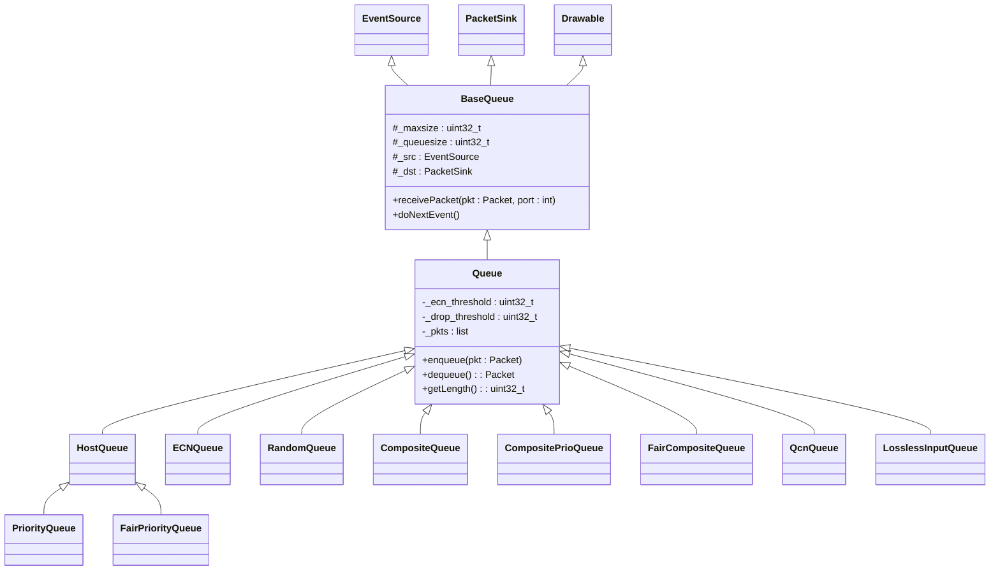
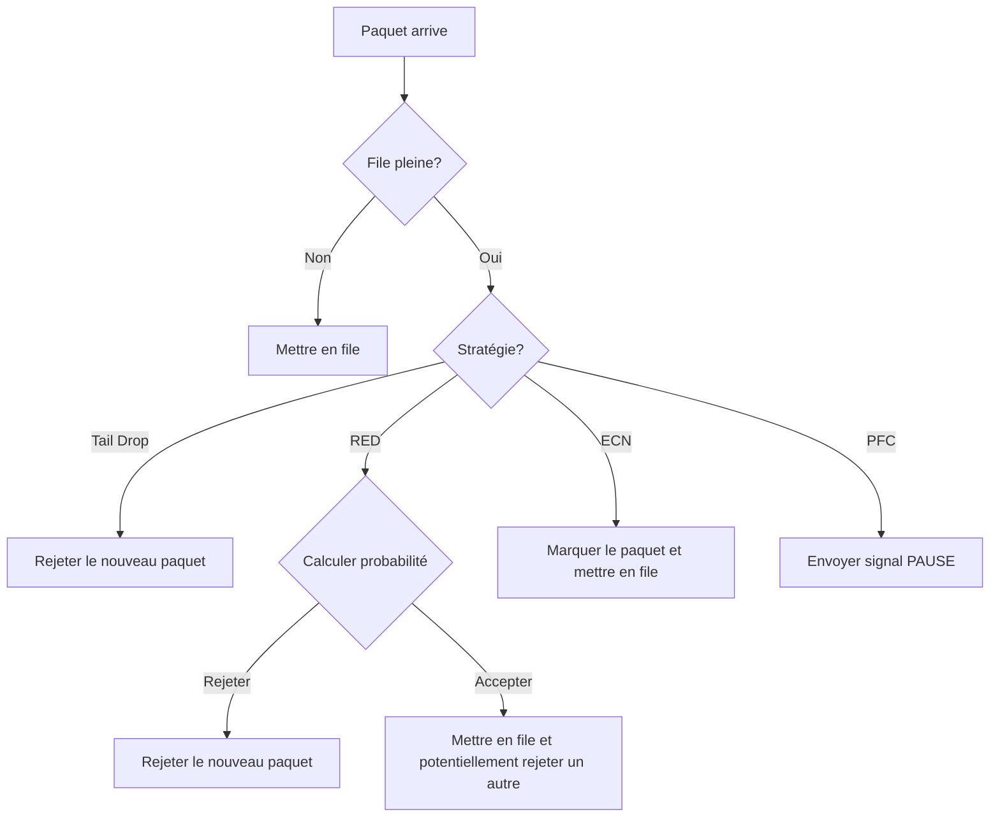
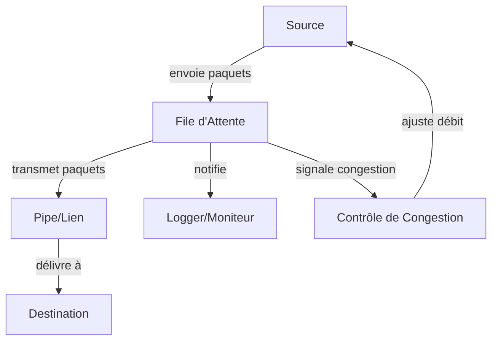

# Files d'Attente dans HTSIM

## Vue d'ensemble

Les files d'attente (Queues) sont des composants centraux du simulateur HTSIM qui modélisent le stockage temporaire et la gestion des paquets dans les nœuds réseau. Elles jouent un rôle crucial dans la simulation du comportement de congestion, étant le point principal où la contention des ressources se manifeste dans un réseau.

## Définition et Objectif

Une file d'attente dans HTSIM représente un tampon qui stocke temporairement les paquets lorsque le taux d'arrivée dépasse la capacité de traitement ou de transmission. Les files d'attente sont essentielles pour :

- Absorber les pics temporaires de trafic
- Implémenter des mécanismes de contrôle de congestion
- Prioriser certains types de trafic
- Fournir des points de mesure pour les statistiques de congestion

## Hiérarchie des Classes de Files d'Attente



## Types de Files d'Attente

HTSIM propose une grande variété de files d'attente pour modéliser différents mécanismes de gestion de la congestion :

### Files d'Attente de Base

#### Queue
La file d'attente standard FIFO (First In, First Out) avec des fonctionnalités optionnelles comme le marquage ECN et le rejet de paquets basé sur des seuils.

#### HostQueue
Une file d'attente spécialisée pour les hôtes terminaux, ajoutant des fonctionnalités spécifiques aux nœuds finaux.

### Files d'Attente Avancées

#### PriorityQueue
Gère plusieurs niveaux de priorité, servant les paquets des niveaux plus élevés avant ceux des niveaux inférieurs.

#### ECNQueue
Implémente le marquage ECN (Explicit Congestion Notification) pour signaler la congestion sans rejeter de paquets.

#### RandomQueue
Rejette ou marque les paquets de manière aléatoire basée sur la probabilité, similaire à RED (Random Early Detection).

#### CompositeQueue
Combine plusieurs files d'attente logiques en une seule entité physique.

#### LosslessInputQueue
Implémente un contrôle de flux basé sur la pression arrière pour éviter la perte de paquets.

#### FairQueue
Assure une répartition équitable de la bande passante entre différents flux.

## Disciplines de File d'Attente

Les files d'attente dans HTSIM peuvent implémenter diverses disciplines de service :

| Discipline | Description | Avantages | Inconvénients |
|------------|-------------|-----------|---------------|
| FIFO | First In, First Out | Simple, faible surcharge | Pas d'isolation entre flux |
| Priorité Stricte | Sert toujours les paquets à haute priorité d'abord | Garanties fortes pour le trafic prioritaire | Risque de famine pour le trafic à faible priorité |
| Round Robin | Sert les flux à tour de rôle | Équité basique entre flux | Pas de différenciation de service |
| Weighted Fair Queueing | Allocation proportionnelle basée sur des poids | Équité configurable | Complexité de mise en œuvre |
| Déficit Round Robin | Ajuste le service en fonction de la taille des paquets | Équité indépendante de la taille des paquets | Complexité accrue |

## Mécanismes de Gestion de la Congestion

### Gestion des Rejets

Les files d'attente HTSIM peuvent utiliser différentes stratégies lorsqu'elles atteignent leur capacité :



#### Tail Drop
Rejette simplement les nouveaux paquets lorsque la file est pleine.

#### RED (Random Early Detection)
Commence à rejeter des paquets de manière probabiliste avant que la file soit complètement pleine.

#### ECN (Explicit Congestion Notification)
Marque les paquets pour signaler la congestion sans les rejeter.

#### PFC (Priority Flow Control)
Envoie un signal à la source pour qu'elle arrête de transmettre temporairement.

### Métriques et Seuils

Les files d'attente utilisent différents seuils et métriques pour leurs décisions :

| Métrique | Description | Utilisation |
|----------|-------------|-------------|
| `_queuesize` | Taille actuelle de la file (en octets ou paquets) | Déterminer si la file est pleine |
| `_maxsize` | Capacité maximale de la file | Définir le point de rejet forcé |
| `_ecn_threshold` | Seuil pour le marquage ECN | Début du marquage préventif |
| `_drop_threshold` | Seuil pour le rejet précoce | Début du rejet probabiliste |

## Paramètres de Configuration

| Paramètre | Description | Impact sur la simulation |
|-----------|-------------|--------------------------|
| `maxsize` | Taille maximale de la file d'attente | Détermine la capacité de mise en tampon |
| `ecn_threshold` | Seuil pour commencer le marquage ECN | Influence le comportement du contrôle de congestion |
| `drop_thresh` | Seuil pour commencer à rejeter des paquets | Affecte le taux de perte de paquets |
| `mean_pktsize` | Taille moyenne des paquets | Utilisé dans les calculs de probabilité RED |
| `queuePolicy` | Politique de gestion de la file | Détermine comment les paquets sont traités |

## Interaction avec d'autres Composants



Les files d'attente interagissent avec :
- **Sources de trafic** : Qui envoient des paquets à la file
- **Pipes/Liens** : Vers lesquels la file transmet les paquets
- **Mécanismes de contrôle de congestion** : Qui réagissent à l'état de la file
- **Systèmes de journalisation** : Qui enregistrent les métriques de performance

## Exemple d'Utilisation

Voici un exemple simplifié de code montrant comment configurer une file d'attente dans HTSIM :

```cpp
// Créer une file d'attente standard avec une capacité de 100 paquets
linkspeed_bps bandwidth = 10000000000;  // 10 Gbps
uint32_t queue_size = 100;              // en paquets
Queue* queue = new Queue(bandwidth, queue_size);

// Activer le marquage ECN à 20% de la capacité
queue->set_ecn_threshold(20);  // Marquer ECN quand la file est à 20% de capacité

// Configurer la destination de la file d'attente (généralement un Pipe)
Pipe* pipe = new Pipe(latency, bandwidth);
queue->setDestination(pipe);

// Connecter une source à la file d'attente
source->setDestination(queue);
```

## Collecte de Statistiques

Les files d'attente dans HTSIM sont instrumentées pour collecter diverses métriques importantes :

- **Occupation moyenne** : Niveau moyen de remplissage de la file
- **Taux de rejet** : Pourcentage de paquets rejetés
- **Taux de marquage ECN** : Pourcentage de paquets marqués
- **Délai de mise en file d'attente** : Temps passé par les paquets dans la file
- **Distribution des délais** : Histogramme des temps d'attente

Ces statistiques sont cruciales pour analyser le comportement du réseau et évaluer l'efficacité des mécanismes de contrôle de congestion.

## Considérations de Performance

La configuration des files d'attente a un impact majeur sur les performances du réseau simulé :

- Des files trop petites peuvent augmenter les pertes de paquets
- Des files trop grandes peuvent augmenter la latence (problème de "bufferbloat")
- Les politiques de rejet et de marquage influencent directement l'efficacité du contrôle de congestion
- Les disciplines de service affectent l'équité entre flux et la qualité de service
