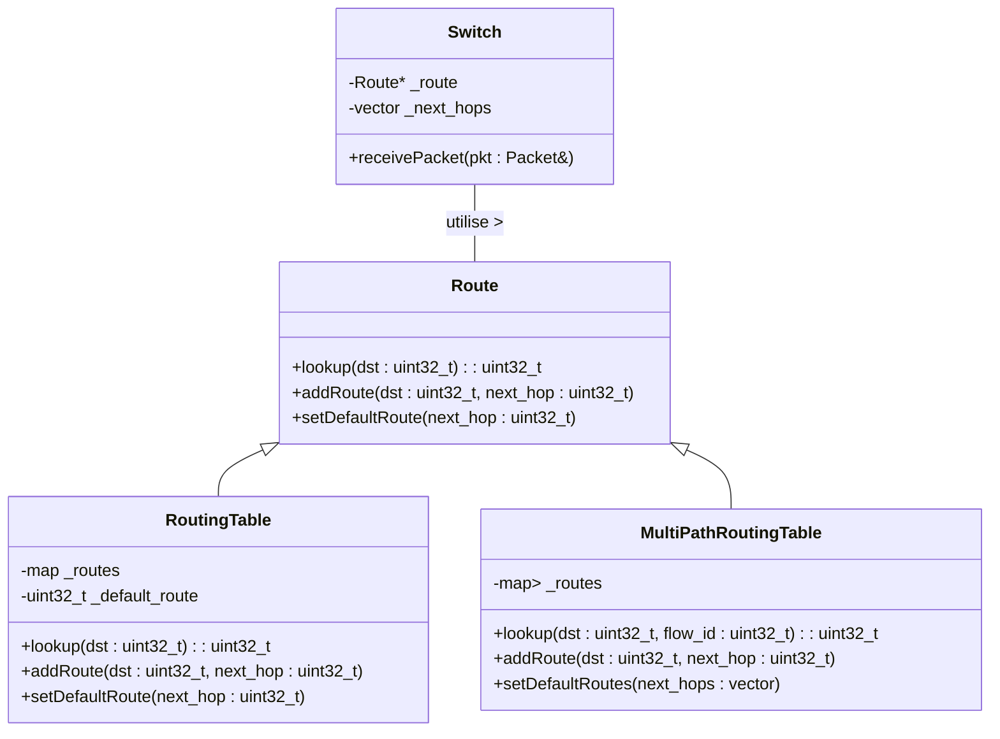
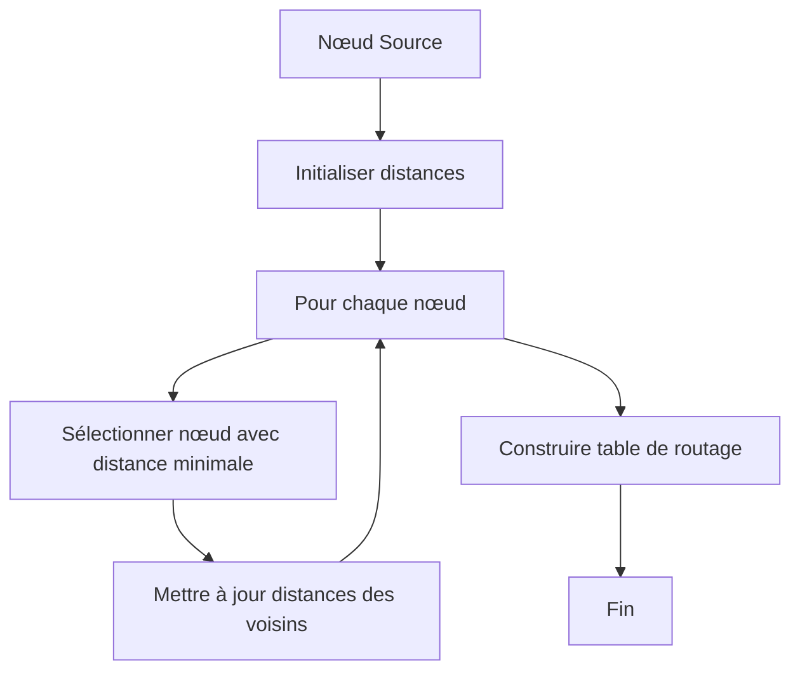
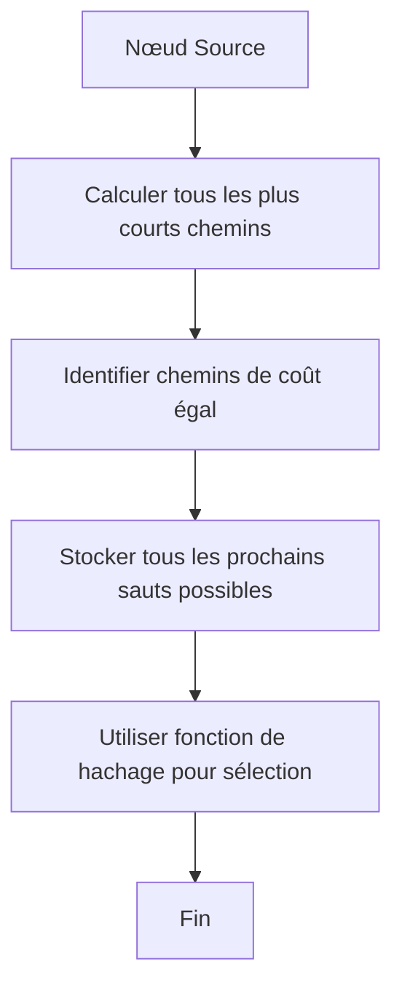
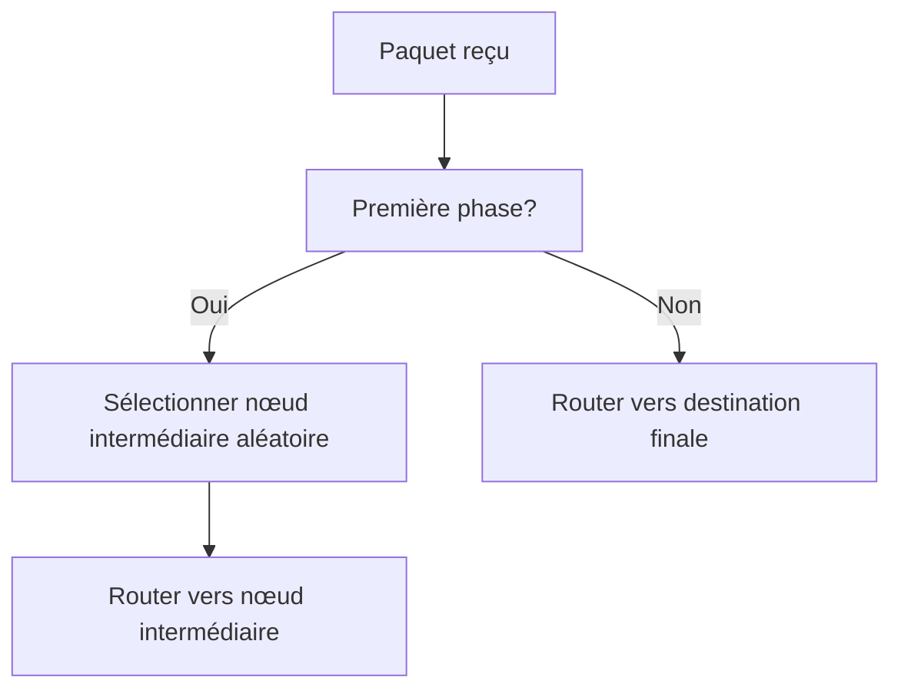

# Logique de Routage dans HTSIM

## Introduction

La logique de routage est un composant essentiel de HTSIM qui détermine comment les paquets se déplacent à travers la topologie réseau simulée. Ce module permet de modéliser divers algorithmes de routage, allant des plus simples aux plus complexes, et joue un rôle crucial dans la fidélité des simulations réseau.

## Principes Fondamentaux

### Fonction du Routage

Le routage dans HTSIM remplit plusieurs fonctions critiques :

1. **Détermination du chemin** : Sélectionner le prochain saut pour chaque paquet
2. **Équilibrage de charge** : Distribuer le trafic sur plusieurs chemins disponibles
3. **Réaction aux défaillances** : Adapter le routage en cas de panne d'un lien ou d'un nœud
4. **Support de politiques** : Implémenter des règles spécifiques pour certains types de trafic

### Architecture Générale



## Types de Routage dans HTSIM

### Routage Statique

Le routage statique est le plus simple et utilise des tables préconfigurées qui ne changent pas pendant la simulation :

```cpp
// Exemple de configuration de routage statique
void configureStaticRouting(Switch* sw, RoutingTable* rt) {
    // Ajouter des entrées pour des destinations spécifiques
    rt->addRoute(0x0A000001, 0);  // Destination 10.0.0.1 -> port 0
    rt->addRoute(0x0A000002, 1);  // Destination 10.0.0.2 -> port 1
    
    // Configurer une route par défaut
    rt->setDefaultRoute(2);       // Autres destinations -> port 2
    
    // Associer la table de routage au commutateur
    sw->setRoutingTable(rt);
}
```

#### Avantages et Inconvénients

| Avantages | Inconvénients |
|-----------|---------------|
| Simple à implémenter | Ne s'adapte pas aux défaillances |
| Très prévisible | Peut conduire à une utilisation sous-optimale des ressources |
| Faible surcharge de calcul | Configuration manuelle lourde pour les grands réseaux |

### Routage à Chemin Unique

Le routage à chemin unique sélectionne un seul chemin optimal entre chaque paire source-destination :

```cpp
class ShortestPathRouter {
private:
    vector<vector<int>> _next_hop_matrix;
    
public:
    // Calculer les chemins les plus courts avec l'algorithme de Dijkstra
    void computeShortestPaths(Graph& topology) {
        // Pour chaque nœud source
        for (int src = 0; src < topology.getNodeCount(); src++) {
            vector<int> distances(topology.getNodeCount(), INT_MAX);
            vector<int> next_hops(topology.getNodeCount(), -1);
            
            // Algorithme de Dijkstra
            // ...
            
            _next_hop_matrix.push_back(next_hops);
        }
    }
    
    // Rechercher le prochain saut
    int lookup(int src, int dst) {
        return _next_hop_matrix[src][dst];
    }
};
```

### Routage Multi-Chemins

Le routage multi-chemins permet d'utiliser plusieurs chemins entre une paire source-destination, améliorant ainsi l'utilisation des ressources réseau :

```cpp
class EqualCostMultiPathRouter {
private:
    vector<vector<vector<int>>> _next_hops_matrix;
    
public:
    // Calculer tous les chemins de coût égal
    void computeECMP(Graph& topology) {
        // Pour chaque nœud source
        for (int src = 0; src < topology.getNodeCount(); src++) {
            // Algorithme modifié pour conserver tous les chemins de coût égal
            // ...
        }
    }
    
    // Sélectionner un des prochains sauts disponibles
    int lookup(int src, int dst, uint32_t flow_id) {
        vector<int>& next_hops = _next_hops_matrix[src][dst];
        
        if (next_hops.empty())
            return -1;  // Pas de chemin disponible
            
        // Hachage basé sur le flow_id pour la cohérence du chemin
        size_t index = flow_id % next_hops.size();
        return next_hops[index];
    }
};
```

#### Stratégies de Distribution du Trafic

| Stratégie | Description | Cas d'usage |
|-----------|-------------|-------------|
| Round-Robin | Distribution cyclique | Trafic homogène |
| Hachage basé sur le flux | Même flux → même chemin | Préserver l'ordre des paquets |
| Hachage pondéré | Bias vers certains chemins | Équilibrage de charge inégal |
| Réactif à la congestion | Évite les chemins congestionnés | Réseaux à charge variable |

### Routage Adaptatif

Le routage adaptatif ajuste dynamiquement les décisions de routage en fonction des conditions du réseau :

```cpp
class AdaptiveRouter {
private:
    Graph _topology;
    vector<vector<int>> _next_hop_matrix;
    map<pair<int, int>, int> _link_loads;
    
public:
    // Mettre à jour les charges des liens
    void updateLinkLoad(int src, int dst, int load) {
        _link_loads[make_pair(src, dst)] = load;
    }
    
    // Recalculer les routes en tenant compte des charges
    void recomputeRoutes() {
        // Algorithme qui considère à la fois les distances et les charges
        // ...
    }
    
    // Rechercher le prochain saut
    int lookup(int src, int dst) {
        return _next_hop_matrix[src][dst];
    }
};
```

## Algorithmes de Routage Spécifiques

### Routage de Plus Court Chemin

Le routage de plus court chemin minimise une métrique spécifique (nombre de sauts, latence, etc.) :



#### Algorithmes courants
- **Dijkstra** : Pour les graphes à poids positifs
- **Bellman-Ford** : Supporte les poids négatifs
- **Floyd-Warshall** : Calcule tous les chemins les plus courts

### Routage Multichemins ECMP

ECMP (Equal Cost Multi-Path) utilise plusieurs chemins de coût égal :



Implémentation typique :

```cpp
uint32_t ecmp_select(vector<uint32_t>& next_hops, Packet& pkt) {
    // Fonction de hachage 5-tuple
    uint32_t hash = hash_function(
        pkt.get_src(),
        pkt.get_dst(),
        pkt.get_src_port(),
        pkt.get_dst_port(),
        pkt.get_protocol()
    );
    
    return next_hops[hash % next_hops.size()];
}
```

### Routage Valiant

Le routage Valiant améliore l'équilibrage de charge dans certaines topologies (ex: fat-tree) :



```cpp
// Exemple simplifié de routage Valiant
int valiantRouting(Packet& pkt, bool& first_phase) {
    if (first_phase) {
        // Première phase: choisir un nœud intermédiaire aléatoire
        int random_node = rand() % _node_count;
        pkt.set_intermediate_dst(random_node);
        first_phase = false;
        
        // Router vers le nœud intermédiaire
        return _routing_table.lookup(random_node);
    } else {
        // Seconde phase: router vers la destination finale
        return _routing_table.lookup(pkt.get_dst());
    }
}
```

## Implémentation du Routage dans les Composants

### Routage dans les Commutateurs

```cpp
void Switch::receivePacket(Packet& pkt) {
    // Déterminer le port de sortie en consultant la table de routage
    int output_port = _route->lookup(pkt.get_dst());
    
    if (output_port >= 0 && output_port < _next_hops.size()) {
        // Transmettre le paquet au prochain saut
        _next_hops[output_port]->receivePacket(pkt);
    } else {
        // Erreur de routage - le paquet est perdu
        delete &pkt;
    }
}
```

### Intégration avec les Topologies

Les topologies spécifiques peuvent avoir des stratégies de routage optimisées :

```cpp
class FatTreeTopology {
private:
    vector<Switch*> _core_switches;
    vector<Switch*> _aggregation_switches;
    vector<Switch*> _edge_switches;
    
public:
    void configureRouting() {
        // Configurer le routage pour une topologie fat-tree
        // ...
        
        // Exemple pour un commutateur de bordure
        for (auto edge_sw : _edge_switches) {
            MultiPathRoutingTable* rt = new MultiPathRoutingTable();
            
            // Routes vers les serveurs locaux
            for (int srv = 0; srv < _serversPerEdge; srv++) {
                rt->addRoute(getServerId(edge_sw->getId(), srv), srv);
            }
            
            // Routes vers les autres pods via les commutateurs d'agrégation
            // ...
            
            edge_sw->setRoutingTable(rt);
        }
    }
};
```

## Protocoles de Routage Dynamiques

HTSIM peut également simuler des protocoles de routage dynamiques :

### OSPF Simplifié

```cpp
class OspfRouter {
private:
    uint32_t _router_id;
    LinkStateDatabase _lsdb;
    RoutingTable _routing_table;
    
public:
    // Recevoir une annonce d'état de lien
    void receiveLSA(LinkStateAnnouncement& lsa) {
        // Mettre à jour la base de données d'état de lien
        _lsdb.update(lsa);
        
        // Recalculer la table de routage
        recalculateRoutingTable();
    }
    
    // Recalculer la table de routage avec l'algorithme de Dijkstra
    void recalculateRoutingTable() {
        // Créer un graphe à partir de la LSDB
        Graph g = _lsdb.createGraph();
        
        // Exécuter Dijkstra
        vector<int> next_hops = dijkstra(g, _router_id);
        
        // Mettre à jour la table de routage
        for (uint32_t dst = 0; dst < next_hops.size(); dst++) {
            if (next_hops[dst] != -1) {
                _routing_table.addRoute(dst, next_hops[dst]);
            }
        }
    }
};
```

### BGP Simplifié

```cpp
class BgpRouter {
private:
    uint32_t _as_number;
    map<uint32_t, vector<BgpRoute>> _rib;
    
public:
    // Recevoir une annonce de route
    void receiveUpdate(BgpUpdate& update) {
        // Appliquer les politiques d'entrée
        if (!applyInboundPolicy(update))
            return;
        
        // Mettre à jour la RIB
        _rib[update.prefix].push_back(update.route);
        
        // Sélectionner la meilleure route
        selectBestRoute(update.prefix);
        
        // Propager les mises à jour aux voisins
        propagateUpdates(update.prefix);
    }
    
    // Sélectionner la meilleure route selon les attributs BGP
    void selectBestRoute(uint32_t prefix) {
        // Algorithme de sélection de route BGP
        // ...
    }
};
```

## Routage Avancé

### Routage Sensible à la QoS

```cpp
class QosRouter {
private:
    map<ServiceClass, RoutingTable*> _routing_tables;
    
public:
    // Rechercher le prochain saut en tenant compte de la classe de service
    int lookup(uint32_t dst, ServiceClass service_class) {
        if (_routing_tables.find(service_class) != _routing_tables.end()) {
            return _routing_tables[service_class]->lookup(dst);
        } else {
            // Utiliser la table par défaut
            return _routing_tables[DEFAULT_CLASS]->lookup(dst);
        }
    }
};
```

### Routage Multicast

```cpp
class MulticastRouter {
private:
    map<uint32_t, vector<int>> _multicast_groups;
    
public:
    // Ajouter un membre à un groupe multicast
    void addGroupMember(uint32_t group_id, int member_port) {
        _multicast_groups[group_id].push_back(member_port);
    }
    
    // Recherche des ports de sortie pour un paquet multicast
    vector<int> lookupGroup(uint32_t group_id) {
        if (_multicast_groups.find(group_id) != _multicast_groups.end()) {
            return _multicast_groups[group_id];
        } else {
            return vector<int>();  // Groupe non trouvé
        }
    }
};
```

## Bonnes Pratiques

### Considérations de Performance

1. **Précomputation** : Calculer les tables de routage avant la simulation quand c'est possible
2. **Structures de données efficaces** : Utiliser des tables de hachage pour les grandes tables de routage
3. **Mise en cache** : Stocker les résultats récents pour les flux fréquents
4. **Routage hiérarchique** : Diviser les grands réseaux en zones pour réduire la taille des tables

### Éviter les Boucles de Routage

```cpp
// Exemple : Détection de boucle avec compteur TTL
void Switch::receivePacket(Packet& pkt) {
    // Décrémenter le TTL
    if (pkt.ttl() <= 0) {
        // Paquet en boucle détecté, éliminer
        delete &pkt;
        return;
    }
    pkt.decrement_ttl();
    
    // Continuer le routage normal
    int output_port = _route->lookup(pkt.get_dst());
    // ...
}
```

### Traitement des Cas d'Erreur

```cpp
// Gestion des erreurs de routage
int RoutingTable::lookup(uint32_t dst) {
    if (_routes.find(dst) != _routes.end()) {
        return _routes[dst];
    } else if (_default_route != -1) {
        return _default_route;
    } else {
        // Aucune route trouvée, journaliser et retourner erreur
        cerr << "Erreur de routage: pas de route pour " << dst << endl;
        return -1;
    }
}
```

## Personnalisation et Extension

### Création d'un Algorithme de Routage Personnalisé

```cpp
class CustomRoutingAlgorithm : public Route {
private:
    // Structures de données spécifiques
    
public:
    // Initialisation
    void initialize(const Topology& topology) {
        // Logique spécifique d'initialisation
    }
    
    // Implémentation de la recherche
    virtual int lookup(uint32_t dst) override {
        // Logique de routage personnalisée
    }
    
    // Méthodes supplémentaires spécifiques
    void updateMetric(int link_id, int new_metric) {
        // Mise à jour des métriques et recalcul
    }
};
```

### Intégration avec des Routages Externes

```cpp
class ExternalRoutingInterface : public Route {
private:
    ExternalRouter* _ext_router;
    
public:
    ExternalRoutingInterface(const string& config_file) {
        // Initialiser l'interface vers le système externe
        _ext_router = new ExternalRouter(config_file);
    }
    
    virtual int lookup(uint32_t dst) override {
        // Déléguer la décision au routeur externe
        return _ext_router->query(dst);
    }
};
```

## Exemples Pratiques

### Configuration d'un Réseau Fat-Tree

```cpp
// Exemple de configuration pour un fat-tree k=4
void setupFatTreeRouting(FatTreeTopology& topology) {
    // Configurer le routage pour les commutateurs de bordure
    for (int pod = 0; pod < 4; pod++) {
        for (int edge = 0; edge < 2; edge++) {
            Switch* sw = topology.getEdgeSwitch(pod, edge);
            MultiPathRoutingTable* rt = new MultiPathRoutingTable();
            
            // Routes vers les serveurs locaux
            for (int server = 0; server < 2; server++) {
                int server_id = pod * 4 + edge * 2 + server;
                rt->addRoute(server_id, server);
            }
            
            // Routes vers les autres pods via les commutateurs d'agrégation
            for (int other_pod = 0; other_pod < 4; other_pod++) {
                if (other_pod == pod) continue;
                
                vector<int> next_hops;
                for (int agg = 0; agg < 2; agg++) {
                    next_hops.push_back(2 + agg);  // Ports vers les agrégation
                }
                
                // Ajouter routes pour tous les serveurs dans l'autre pod
                for (int s = 0; s < 4; s++) {
                    int server_id = other_pod * 4 + s;
                    rt->addMultiPathRoute(server_id, next_hops);
                }
            }
            
            sw->setRoutingTable(rt);
        }
    }
    
    // Configuration similaire pour les commutateurs d'agrégation et de cœur
    // ...
}
```

### Simulation d'un Protocole de Routage Dynamique

```cpp
// Simulation d'une convergence OSPF après une panne de lien
void simulateLinkFailure(EventList& eventlist, Network& network) {
    // Planifier une panne de lien
    eventlist.addEvent(SECOND * 10, new LinkFailureEvent(network.getLink(5, 7)));
    
    // Planifier la propagation des LSA
    for (int i = 0; i < network.getRouterCount(); i++) {
        OspfRouter* router = network.getRouter(i);
        
        // Chaque routeur recevra et propagera les LSA
        eventlist.addEvent(SECOND * 10 + MILLISEC * (10 + i * 5),
                          new LsaProcessingEvent(router));
    }
    
    // Planifier la vérification de convergence
    eventlist.addEvent(SECOND * 11, new ConvergenceCheckEvent(&network));
}
```

## Conclusion

La logique de routage est un composant fondamental dans HTSIM qui détermine le comportement et l'efficacité du réseau simulé. Une compréhension approfondie des différentes approches de routage permet de concevoir des simulations plus réalistes et pertinentes.

HTSIM offre la flexibilité nécessaire pour implémenter une large gamme d'algorithmes et de protocoles de routage, des plus simples aux plus complexes, permettant ainsi de modéliser fidèlement les réseaux modernes dans divers scénarios et conditions.
