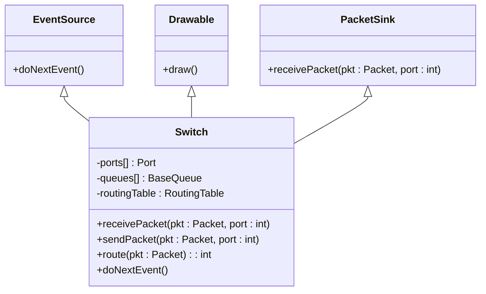
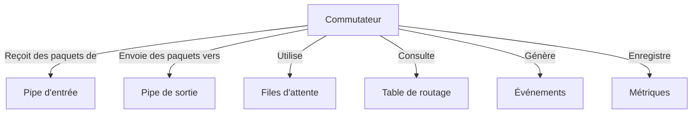

# Commutateurs dans HTSIM

## Vue d'ensemble

Les commutateurs sont des composants fondamentaux dans HTSIM qui modélisent le comportement des équipements réseau chargés de transférer les paquets entre différents points du réseau. Dans le simulateur, ils implémentent diverses stratégies de commutation et de gestion des files d'attente.

## Définition et Objectif

Un commutateur dans HTSIM représente un nœud réseau capable de recevoir des paquets sur plusieurs ports d'entrée et de les transmettre vers les ports de sortie appropriés en fonction des décisions de routage. Ce composant est essentiel pour modéliser avec précision les transferts de données dans les topologies réseau.

## Structure de la Classe Switch



## Types de Commutateurs

HTSIM supporte plusieurs types de commutateurs pour répondre à différents besoins de simulation :

### Commutateurs Standards

Les commutateurs standards implémentent le comportement classique de transfert de paquets avec diverses politiques de mise en file d'attente.

### Commutateurs avec Tampons d'Entrée

Ces commutateurs modélisent des tampons d'entrée où les paquets sont mis en file d'attente avant d'être traités, ce qui est courant dans les équipements réseau réels.

### Commutateurs avec Tampons de Sortie

Ces commutateurs placent les paquets dans des files d'attente de sortie après avoir pris les décisions de routage, ce qui est également un modèle courant.

### Commutateurs Hybrides

Les commutateurs hybrides combinent les approches de mise en tampon d'entrée et de sortie pour modéliser des architectures plus complexes.

## Paramètres de Configuration

| Paramètre | Description | Valeur par défaut | Impact sur la simulation |
|-----------|-------------|-------------------|--------------------------|
| `portCount` | Nombre de ports du commutateur | Défini lors de la création | Détermine combien de connexions le commutateur peut gérer |
| `schedulingPolicy` | Politique d'ordonnancement des ports | Round Robin | Influence l'ordre dans lequel les paquets sont traités |
| `routingTable` | Table de routage pour les décisions de transfert | Vide | Détermine comment les paquets sont acheminés |
| `queuePolicy` | Type de files d'attente utilisées | File simple | Affecte la gestion de la congestion |

## Mécanismes d'Arbitrage

Les commutateurs dans HTSIM implémentent différents mécanismes d'arbitrage pour décider quels paquets sont traités en premier lorsque plusieurs paquets sont en attente :

- **Round Robin** : Traite les ports d'entrée à tour de rôle
- **Priorité Stricte** : Traite toujours les paquets à haute priorité avant ceux à priorité inférieure
- **Poids Variable** : Attribue différents poids aux ports ou aux files d'attente pour une répartition proportionnelle du traitement

## Stratégies de Gestion des Files d'Attente

Les commutateurs peuvent être configurés pour utiliser différentes stratégies de gestion des files d'attente :

- **Tail Drop** : Les paquets sont simplement rejetés lorsque la file d'attente est pleine
- **RED (Random Early Detection)** : Les paquets sont rejetés de manière probabiliste à mesure que la file d'attente se remplit
- **ECN (Explicit Congestion Notification)** : Marque les paquets au lieu de les rejeter lorsque la congestion est détectée

## Interaction avec d'autres Composants



Les commutateurs interagissent étroitement avec :
- **Pipes** : Pour recevoir et envoyer des paquets
- **Files d'attente** : Pour stocker temporairement les paquets
- **Tables de routage** : Pour déterminer où envoyer les paquets
- **Gestionnaire d'événements** : Pour programmer les futurs événements

## Modélisation des Pannes

HTSIM permet de simuler des pannes de commutateurs ou de liens pour tester la résilience des topologies réseau et des protocoles :

- Panne complète du commutateur
- Panne de ports individuels
- Dégradation de performance (ex : ralentissement du traitement)

## Exemple d'Utilisation

Voici un exemple simplifié de code montrant comment configurer un commutateur dans HTSIM :

```cpp
// Créer un commutateur avec 4 ports
Switch* sw = new Switch(4);

// Configurer les files d'attente sur chaque port de sortie
for (int i = 0; i < 4; i++) {
    Queue* q = new Queue(linkspeed, queuesize);
    sw->setQueue(i, q);
}

// Configurer les liens connectés au commutateur
for (int i = 0; i < 4; i++) {
    Pipe* p = new Pipe(latency);
    p->setDestination(sw, i);  // Connecter le pipe au port i du commutateur
}

// Ajouter une entrée dans la table de routage
sw->addRoute(destIP, destPort);
```

## Considérations de Performance

La façon dont les commutateurs sont modélisés et configurés dans HTSIM peut avoir un impact significatif sur les performances de la simulation :

- Des commutateurs complexes avec de nombreuses fonctionnalités peuvent ralentir la simulation
- La taille des files d'attente et les politiques de gestion affectent la mémoire utilisée
- Un grand nombre de commutateurs dans la topologie augmente la complexité de la simulation
