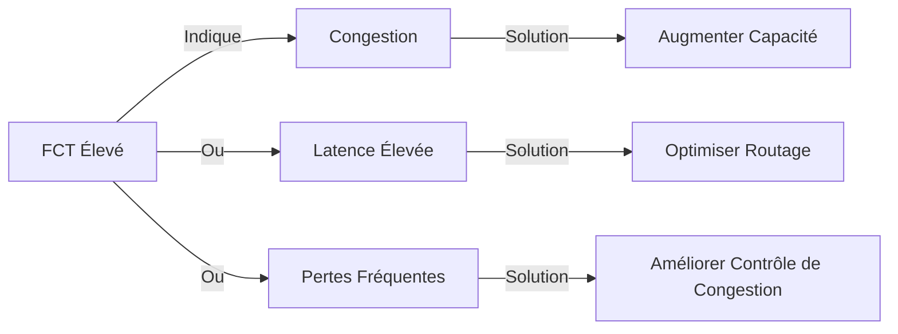

# Analyse des Résultats de Simulation HTSIM

## Introduction à l'Analyse des Résultats

L'analyse des résultats est une étape cruciale dans le processus de simulation réseau avec HTSIM. Cette section explique comment interpréter les données de sortie, visualiser les résultats et extraire des métriques significatives de vos simulations.

## Formats de Sortie de HTSIM

HTSIM génère plusieurs types de fichiers de sortie qui contiennent différentes métriques de performance réseau.

### Structure des Fichiers de Sortie

Lorsque vous exécutez une simulation avec l'option `-o <préfixe>`, HTSIM génère plusieurs fichiers avec ce préfixe :

| Fichier | Description | Contenu |
|---------|-------------|---------|
| `<préfixe>.log` | Journal principal | Événements clés de la simulation |
| `<préfixe>.out` | Résultats généraux | Résumé des métriques globales |
| `<préfixe>_flows.csv` | Statistiques des flux | Métriques par flux |
| `<préfixe>_queues.csv` | Statistiques des files d'attente | Métriques des files d'attente |
| `<préfixe>_links.csv` | Statistiques des liens | Utilisation des liens |
| `<préfixe>_tcp_cwnd.csv` | Fenêtres TCP | Évolution des fenêtres de congestion TCP |
| `<préfixe>_rtt.csv` | Mesures RTT | Temps d'aller-retour observés |

### Format de Données

Les fichiers CSV contiennent généralement des données structurées comme suit :

```
# Exemple de format pour un fichier _flows.csv
# temps,id_flux,debit,latence,paquets_envoyes,paquets_recus,paquets_perdus
0.1,0,94.5,0.000215,120,118,2
0.1,1,87.2,0.000203,112,112,0
0.2,0,98.7,0.000198,125,124,1
0.2,1,92.5,0.000205,118,117,1
...
```

## Outil d'Analyse Intégré : parse_output

HTSIM est fourni avec un outil d'analyse appelé `parse_output` qui permet d'extraire et de formater les données des fichiers de sortie.

### Utilisation de Base

```bash
# Syntaxe générale
./parse_output [options] <fichier_de_sortie>

# Exemples
./parse_output ndp_results.out > ndp_parsed.txt
./parse_output -q dctcp_results.out > dctcp_queue_stats.txt
./parse_output -f tcp_results.out > tcp_flow_stats.txt
```

### Options Principales de parse_output

| Option | Description |
|--------|-------------|
| `-f` | Extrait les statistiques des flux |
| `-q` | Extrait les statistiques des files d'attente |
| `-l` | Extrait les statistiques d'utilisation des liens |
| `-t` | Extrait les séries temporelles |
| `-a` | Extrait toutes les statistiques disponibles |
| `-csv` | Produit une sortie au format CSV |

### Exemple d'Utilisation Avancée

```bash
# Extraire les statistiques des flux et calculer le temps moyen de complétion
./parse_output -f -fct ndp_results.out > ndp_fct_stats.txt

# Extraire l'évolution de l'occupation des files d'attente dans le temps
./parse_output -q -t dctcp_results.out > dctcp_queue_timeseries.csv
```

## Métriques Clés et Leur Interprétation

### Métriques de Performance Réseau

| Métrique | Description | Interprétation |
|----------|-------------|----------------|
| **Débit** | Quantité de données transmises par unité de temps | Un débit élevé et stable indique une bonne utilisation de la capacité |
| **Latence** | Temps nécessaire pour qu'un paquet traverse le réseau | Une latence faible et stable est préférable pour la plupart des applications |
| **Gigue (Jitter)** | Variation de la latence | Une gigue faible est essentielle pour les applications temps réel |
| **Taux de Perte** | Pourcentage de paquets perdus | Un taux élevé indique une congestion ou des problèmes de fiabilité |

### Métriques Spécifiques aux Files d'Attente

| Métrique | Description | Interprétation |
|----------|-------------|----------------|
| **Occupation Moyenne** | Niveau de remplissage moyen de la file | Indique le niveau de congestion moyen |
| **Occupation Maximale** | Niveau de remplissage maximal | Montre si la file atteint sa capacité maximale |
| **Taux de Rejet** | Pourcentage de paquets rejetés | Indique la sévérité de la congestion |
| **Taux de Marquage ECN** | Pourcentage de paquets marqués ECN | Montre la fréquence de détection précoce de congestion |

### Métriques Spécifiques aux Flux

| Métrique | Description | Interprétation |
|----------|-------------|----------------|
| **Temps de Complétion (FCT)** | Temps pour terminer un transfert complet | Crucial pour les performances perçues par l'utilisateur |
| **Évolution de CWND** | Taille de la fenêtre de congestion au fil du temps | Révèle le comportement du contrôle de congestion |
| **RTT (Round-Trip Time)** | Temps d'aller-retour | Affecte directement la réactivité du protocole |
| **Équité (Fairness)** | Mesure de l'équité dans l'allocation des ressources | Un index proche de 1 indique une bonne équité entre flux |

## Visualisation des Résultats

La visualisation est essentielle pour interpréter efficacement les résultats de simulation. Voici différentes approches pour visualiser vos données.

### Utilisation de Gnuplot

Gnuplot est un outil polyvalent pour générer des graphiques à partir de fichiers de données :

```bash
# Script Gnuplot pour visualiser le débit au fil du temps
gnuplot <<EOF
set terminal png size 800,600
set output "throughput_over_time.png"
set title "Débit au Fil du Temps"
set xlabel "Temps (s)"
set ylabel "Débit (Mbps)"
set grid
plot "ndp_parsed.txt" using 1:2 with lines title "Flux NDP"
EOF
```

### Utilisation de Python avec Matplotlib

Python offre des outils puissants pour l'analyse et la visualisation des données :

```python
#!/usr/bin/env python3
import pandas as pd
import matplotlib.pyplot as plt
import numpy as np

# Charger les données (supposons un format CSV)
data = pd.read_csv('ndp_flows.csv')

# Créer un graphique du débit moyen par flux
plt.figure(figsize=(10, 6))
flows = data['flow_id'].unique()
for flow in flows:
    flow_data = data[data['flow_id'] == flow]
    plt.plot(flow_data['time'], flow_data['throughput'], label=f'Flux {flow}')

plt.title('Débit par Flux au Fil du Temps')
plt.xlabel('Temps (s)')
plt.ylabel('Débit (Mbps)')
plt.legend()
plt.grid(True)
plt.savefig('flow_throughput.png')
plt.show()
```

### Création de Heatmaps pour les Matrices de Trafic

Pour visualiser des patterns complexes comme l'utilisation de lien dans une topologie Fat-tree :

```python
#!/usr/bin/env python3
import pandas as pd
import numpy as np
import matplotlib.pyplot as plt
import seaborn as sns

# Charger les données d'utilisation des liens
data = pd.read_csv('fattree_links.csv')

# Créer une matrice d'utilisation
num_links = data['link_id'].max() + 1
utilization_matrix = np.zeros((num_links, num_links))

# Remplir la matrice avec les données d'utilisation
for _, row in data.iterrows():
    src = int(row['source'])
    dst = int(row['destination'])
    utilization = float(row['utilization'])
    utilization_matrix[src, dst] = utilization

# Créer une heatmap
plt.figure(figsize=(12, 10))
sns.heatmap(utilization_matrix, cmap='YlOrRd', annot=False)
plt.title('Heatmap d\'Utilisation des Liens')
plt.xlabel('ID de Destination')
plt.ylabel('ID de Source')
plt.savefig('link_utilization_heatmap.png')
plt.show()
```

## Comparaison des Algorithmes

Une tâche courante est de comparer différents algorithmes ou configurations. Voici comment procéder :

### Script pour Comparer les Algorithmes

```python
#!/usr/bin/env python3
import pandas as pd
import matplotlib.pyplot as plt
import numpy as np

# Fonction pour charger et traiter les données
def load_flow_stats(filename):
    data = pd.read_csv(filename)
    fct_avg = data['completion_time'].mean()
    fct_p99 = np.percentile(data['completion_time'], 99)
    throughput_avg = data['throughput'].mean()
    return {
        'fct_avg': fct_avg,
        'fct_p99': fct_p99,
        'throughput_avg': throughput_avg
    }

# Charger les données pour différents algorithmes
algorithms = ['tcp', 'dctcp', 'ndp', 'swift']
results = {}

for alg in algorithms:
    results[alg] = load_flow_stats(f'{alg}_flows.csv')

# Créer un graphique comparatif pour le temps de complétion moyen
plt.figure(figsize=(10, 6))
algs = list(results.keys())
fcts = [results[alg]['fct_avg'] for alg in algs]

plt.bar(algs, fcts)
plt.title('Temps de Complétion Moyen par Algorithme')
plt.xlabel('Algorithme')
plt.ylabel('Temps de Complétion (s)')
plt.grid(axis='y')
plt.savefig('algorithm_fct_comparison.png')

# Créer un tableau comparatif complet
comparison_df = pd.DataFrame({
    'Algorithme': algs,
    'FCT Moyen (ms)': [results[alg]['fct_avg']*1000 for alg in algs],
    'FCT P99 (ms)': [results[alg]['fct_p99']*1000 for alg in algs],
    'Débit Moyen (Mbps)': [results[alg]['throughput_avg'] for alg in algs]
})

comparison_df.to_csv('algorithm_comparison.csv', index=False)
print(comparison_df)
```

## Analyse Statistique Avancée

Pour des analyses plus sophistiquées, vous pouvez utiliser des méthodes statistiques avancées :

### Analyse de Distribution

```python
#!/usr/bin/env python3
import pandas as pd
import matplotlib.pyplot as plt
import numpy as np
import scipy.stats as stats

# Charger les données
data = pd.read_csv('ndp_flows.csv')
fcts = data['completion_time']

# Calculer des statistiques de base
mean_fct = np.mean(fcts)
median_fct = np.median(fcts)
std_fct = np.std(fcts)
p99_fct = np.percentile(fcts, 99)

# Créer un histogramme avec une courbe de distribution
plt.figure(figsize=(10, 6))
plt.hist(fcts, bins=30, density=True, alpha=0.7, color='steelblue')

# Ajouter une ligne verticale pour la moyenne et le P99
plt.axvline(mean_fct, color='red', linestyle='dashed', linewidth=2, label=f'Moyenne: {mean_fct:.3f}s')
plt.axvline(p99_fct, color='green', linestyle='dashed', linewidth=2, label=f'P99: {p99_fct:.3f}s')

# Ajouter une courbe de densité de probabilité
xmin, xmax = plt.xlim()
x = np.linspace(xmin, xmax, 100)
p = stats.norm.pdf(x, mean_fct, std_fct)
plt.plot(x, p, 'k', linewidth=2, label='Distribution normale')

plt.title('Distribution des Temps de Complétion de Flux')
plt.xlabel('Temps de Complétion (s)')
plt.ylabel('Densité')
plt.legend()
plt.grid(True)
plt.savefig('fct_distribution.png')
plt.show()
```

## Automatisation de l'Analyse

Pour les campagnes de simulation étendues, automatisez l'analyse :

### Script d'Analyse Automatisée

```bash
#!/bin/bash

# Répertoire contenant les résultats de simulation
RESULTS_DIR="./simulation_results"
OUTPUT_DIR="./analysis_results"

# Créer le répertoire de sortie s'il n'existe pas
mkdir -p $OUTPUT_DIR

# Analyser tous les fichiers de résultats
for result_file in $RESULTS_DIR/*.out; do
    base_name=$(basename $result_file .out)
    
    echo "Analyse de $result_file..."
    
    # Extraire les statistiques générales
    ./parse_output -a $result_file > $OUTPUT_DIR/${base_name}_parsed.txt
    
    # Extraire les statistiques des flux au format CSV
    ./parse_output -f -csv $result_file > $OUTPUT_DIR/${base_name}_flows.csv
    
    # Extraire les statistiques des files d'attente au format CSV
    ./parse_output -q -csv $result_file > $OUTPUT_DIR/${base_name}_queues.csv
    
    # Générer des graphiques avec Python
    python3 generate_plots.py $OUTPUT_DIR/${base_name}_flows.csv $OUTPUT_DIR/${base_name}
done

# Générer un rapport comparatif
python3 generate_comparison.py $OUTPUT_DIR

echo "Analyse terminée. Les résultats sont dans $OUTPUT_DIR"
```

## Interprétation Approfondie des Métriques

### Analyse des Temps de Complétion de Flux (FCT)

Le FCT est une métrique critique pour évaluer les performances d'un réseau :



### Analyse de la Fairness (Équité)

L'équité entre les flux est souvent évaluée à l'aide de l'indice de Jain :

```python
def jain_fairness_index(throughputs):
    """
    Calcule l'indice d'équité de Jain pour un ensemble de débits.
    Un indice de 1 signifie une équité parfaite.
    """
    n = len(throughputs)
    if n == 0:
        return 0
    
    sum_throughput = sum(throughputs)
    sum_squared = sum(x**2 for x in throughputs)
    
    return (sum_throughput**2) / (n * sum_squared)
```

### Analyse de l'Utilisation des Files d'Attente

L'occupation des files d'attente révèle beaucoup sur l'état de congestion du réseau :

| Niveau d'Occupation | Interprétation | Action Recommandée |
|---------------------|----------------|---------------------|
| Très faible (<20%) | Sous-utilisation des ressources | Augmenter le débit ou réduire la capacité |
| Modéré (20-70%) | Fonctionnement optimal | Maintenir la configuration actuelle |
| Élevé (70-90%) | Risque de congestion | Surveiller attentivement, considérer l'augmentation de capacité |
| Très élevé (>90%) | Congestion sévère | Augmenter la capacité ou améliorer le contrôle de congestion |

## Bonnes Pratiques pour l'Analyse

1. **Répétition des simulations** : Exécutez chaque simulation plusieurs fois avec différentes graines pour obtenir des résultats statistiquement significatifs

2. **Analyse comparative** : Comparez toujours vos résultats à un cas de référence (baseline)

3. **Visualisation efficace** : Utilisez le type de graphique le plus approprié pour chaque métrique
   - Séries temporelles pour l'évolution du débit
   - Histogrammes pour les distributions
   - Boxplots pour comparer des ensembles de valeurs
   - Heatmaps pour les matrices de trafic

4. **Analyse multi-échelle** : Examinez les données à différentes échelles temporelles (microsecondes, millisecondes, secondes)

5. **Documentation** : Documentez précisément les conditions et paramètres de chaque simulation pour assurer la reproductibilité
