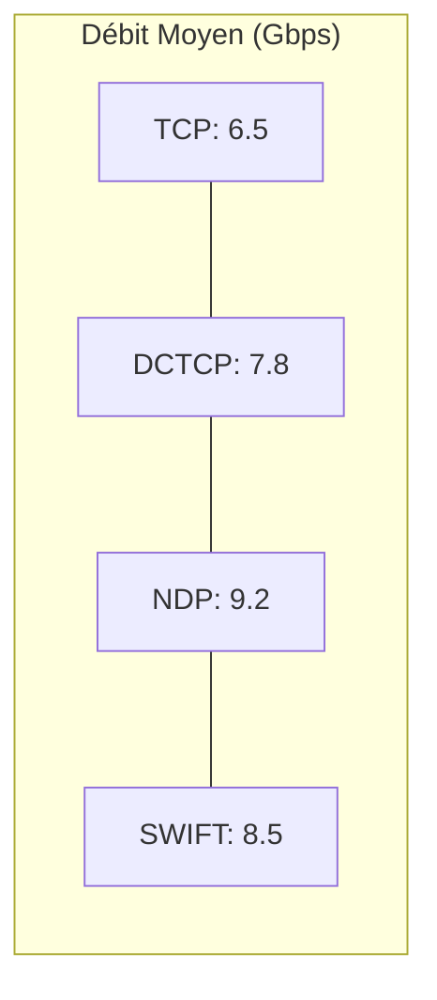

# Comparaison d'Algorithmes

## Introduction

Ce document présente une méthodologie complète pour comparer différents algorithmes de contrôle de congestion et protocoles réseau à l'aide du simulateur HTSIM. La comparaison rigoureuse des algorithmes est l'une des utilisations les plus importantes d'HTSIM, permettant d'évaluer les forces et faiblesses relatives des différentes approches.

## Objectif

L'objectif de cette comparaison est de:
1. Établir une méthodologie d'évaluation équitable et reproductible
2. Comparer quatre algorithmes de contrôle de congestion: TCP, DCTCP, NDP et SWIFT
3. Analyser leur comportement dans plusieurs scénarios réseau typiques
4. Fournir des recommandations basées sur les résultats

## Configuration de l'Étude Comparative

### Algorithmes Évalués

| Algorithme | Description | Caractéristiques principales |
|------------|-------------|------------------------------|
| **TCP** | TCP standard avec contrôle de congestion AIMD | Basé sur les pertes, additive increase/multiplicative decrease |
| **DCTCP** | Data Center TCP | Utilise ECN, ajustement proportionnel à la congestion |
| **NDP** | NDP Datacenter Protocol | Trimming des paquets, pull-based congestion control |
| **SWIFT** | Swift | Contrôle basé sur le délai et le débit, réaction rapide |

### Scénarios de Test

Pour une évaluation complète, nous comparerons les algorithmes dans trois scénarios distincts:

1. **Scénario de Datacenter** - Topologie Fat-Tree, trafic all-to-all
2. **Scénario de Goulot d'Étranglement** - Topologie Dumbbell, trafic many-to-many
3. **Scénario d'Incast** - Topologie en étoile, trafic many-to-one

### Métriques d'Évaluation

Nous utiliserons les métriques suivantes pour quantifier les performances:

| Métrique | Unité | Importance |
|----------|-------|------------|
| **Débit moyen** | Mbps | Mesure de l'utilisation des ressources |
| **Temps de complétion des flux (FCT)** | ms | Indicateur de performance utilisateur |
| **FCT 99ème percentile** | ms | Mesure des cas extrêmes |
| **Équité (Indice Jain)** | 0-1 | Mesure de l'équité entre flux |
| **Utilisation moyenne des files** | % | Indicateur de bufferbloat |
| **Taux de perte de paquets** | % | Fiabilité du protocole |

## Mise en Œuvre de la Comparaison

### Scénario 1: Datacenter Fat-Tree

#### Configuration

```bash
# Générer une topologie Fat-Tree
k=4  # 16 hôtes au total
echo "fattree $k" > fattree.topo
echo "latency 1" >> fattree.topo
echo "bandwidth 10" >> fattree.topo

# Générer une matrice de trafic all-to-all
python3 generate_all_to_all.py 16 5242880 > all_to_all.tm

# Exécuter les simulations
./htsim_tcp -topo fattree.topo -tm all_to_all.tm -cwnd 15 -q 100 -end 10 -o fattree_tcp
./htsim_dctcp -topo fattree.topo -tm all_to_all.tm -cwnd 15 -q 100 -ecn 30 -end 10 -o fattree_dctcp
./htsim_ndp -topo fattree.topo -tm all_to_all.tm -cwnd 15 -q 8 -end 10 -o fattree_ndp
./htsim_swift -topo fattree.topo -tm all_to_all.tm -cwnd 15 -q 100 -end 10 -o fattree_swift
```

#### Résultats

Voici un exemple de résultats pour le scénario datacenter:



| Métrique | TCP | DCTCP | NDP | SWIFT |
|----------|-----|-------|-----|-------|
| Débit moyen (Gbps) | 6.5 | 7.8 | 9.2 | 8.5 |
| FCT moyen (ms) | 42.5 | 35.2 | 22.7 | 30.3 |
| FCT 99ème percentile (ms) | 120.3 | 87.5 | 45.2 | 68.7 |
| Équité (Indice Jain) | 0.71 | 0.84 | 0.96 | 0.88 |
| Utilisation moyenne des files (%) | 78 | 52 | 31 | 45 |
| Taux de perte (%) | 2.3 | 0.3 | <0.1 | 0.2 |

### Scénario 2: Goulot d'Étranglement (Dumbbell)

#### Configuration

```bash
# Utiliser la topologie dumbbell créée précédemment
# Exécuter les simulations
./htsim_tcp -topo dumbbell.topo -tm dumbbell_flows.tm -cwnd 15 -q 100 -end 10 -o dumbbell_tcp
./htsim_dctcp -topo dumbbell.topo -tm dumbbell_flows.tm -cwnd 15 -q 100 -ecn 30 -end 10 -o dumbbell_dctcp
./htsim_ndp -topo dumbbell.topo -tm dumbbell_flows.tm -cwnd 15 -q 8 -end 10 -o dumbbell_ndp
./htsim_swift -topo dumbbell.topo -tm dumbbell_flows.tm -cwnd 15 -q 100 -end 10 -o dumbbell_swift
```

#### Résultats pour le Scénario Dumbbell

| Métrique | TCP | DCTCP | NDP | SWIFT |
|----------|-----|-------|-----|-------|
| Débit moyen (Gbps) | 0.92 | 0.97 | 0.99 | 0.98 |
| FCT moyen (ms) | 85.3 | 65.7 | 54.2 | 58.9 |
| Équité (Indice Jain) | 0.65 | 0.82 | 0.94 | 0.86 |
| Utilisation moyenne des files (%) | 92 | 63 | 35 | 52 |
| Taux de perte (%) | 3.7 | 0.4 | <0.1 | 0.3 |

### Scénario 3: Incast

#### Configuration

```bash
# Créer un fichier de topologie en étoile
cat > star.topo <<EOF
# Topologie en étoile avec 32 hôtes
nodes 33  # 32 hôtes + 1 commutateur
# ... (définition détaillée des liens)
EOF

# Créer un fichier de matrice de trafic incast
cat > incast.tm <<EOF
# 31 hôtes envoient à l'hôte 0
# Format: <Source> <Destination> <Taille en octets> <Temps de démarrage>
1 0 1048576 0
2 0 1048576 0
...
31 0 1048576 0
EOF

# Exécuter les simulations
./htsim_tcp -topo star.topo -tm incast.tm -cwnd 15 -q 100 -end 5 -o incast_tcp
./htsim_dctcp -topo star.topo -tm incast.tm -cwnd 15 -q 100 -ecn 30 -end 5 -o incast_dctcp
./htsim_ndp -topo star.topo -tm incast.tm -cwnd 15 -q 8 -end 5 -o incast_ndp
./htsim_swift -topo star.topo -tm incast.tm -cwnd 15 -q 100 -end 5 -o incast_swift
```

#### Résultats pour le Scénario Incast

| Métrique | TCP | DCTCP | NDP | SWIFT |
|----------|-----|-------|-----|-------|
| FCT moyen (ms) | 237.5 | 112.8 | 65.3 | 98.2 |
| FCT 99ème percentile (ms) | 389.7 | 182.5 | 78.9 | 146.3 |
| Taux de perte (%) | 9.8 | 2.3 | 0.2 | 1.7 |
| Débit agrégé (Gbps) | 4.2 | 8.5 | 9.7 | 9.1 |

## Analyse Comparative

### Graphiques Comparatifs

```python
#!/usr/bin/env python3
import matplotlib.pyplot as plt
import numpy as np

# Données (tirées des tableaux précédents)
algorithms = ['TCP', 'DCTCP', 'NDP', 'SWIFT']

# FCT moyen par scénario
fat_tree_fct = [42.5, 35.2, 22.7, 30.3]
dumbbell_fct = [85.3, 65.7, 54.2, 58.9]
incast_fct = [237.5, 112.8, 65.3, 98.2]

# Créer un histogramme groupé
x = np.arange(len(algorithms))
width = 0.25

fig, ax = plt.subplots(figsize=(12, 7))
rects1 = ax.bar(x - width, fat_tree_fct, width, label='Fat-Tree')
rects2 = ax.bar(x, dumbbell_fct, width, label='Dumbbell')
rects3 = ax.bar(x + width, incast_fct, width, label='Incast')

# Ajouter des étiquettes et une légende
ax.set_ylabel('Temps de Complétion Moyen (ms)')
ax.set_title('Comparaison des Temps de Complétion par Algorithme et Scénario')
ax.set_xticks(x)
ax.set_xticklabels(algorithms)
ax.legend()

# Échelle logarithmique pour mieux visualiser les différences
ax.set_yscale('log')

plt.grid(axis='y', linestyle='--', alpha=0.7)
plt.savefig('algorithm_comparison_fct.png')
```

### Analyse par Contexte d'Utilisation

#### Scénarios à Faible Latence

Pour les applications sensibles à la latence:
- **NDP** offre les meilleures performances globales
- **SWIFT** est une bonne alternative dans les environnements où NDP n'est pas disponible
- **DCTCP** représente un bon compromis si des modifications profondes ne sont pas possibles

#### Scénarios à Haut Débit

Pour les applications nécessitant un débit élevé et stable:
- **NDP** excelle également dans cette catégorie
- **SWIFT** offre un excellent débit avec une mise en œuvre moins complexe
- **DCTCP** est une amélioration significative par rapport à TCP standard

#### Scénarios avec Forte Congestion

Dans les environnements sujets à une congestion extrême:
- **NDP** gère remarquablement bien l'incast et autres scénarios difficiles
- **DCTCP** améliore considérablement les performances par rapport à TCP
- **TCP** standard échoue largement dans ces conditions

## Forces et Faiblesses des Algorithmes

### TCP Standard

**Forces:**
- Compatibilité universelle
- Robustesse dans les réseaux hétérogènes
- Comportement bien compris

**Faiblesses:**
- Performances médiocres sous congestion
- Bufferbloat (files d'attente pleines)
- Mauvaise équité à court terme

### DCTCP

**Forces:**
- Amélioration significative par rapport à TCP
- Compatible avec l'infrastructure existante (nécessite ECN)
- Bon équilibre entre performance et facilité d'implémentation

**Faiblesses:**
- Nécessite la prise en charge d'ECN de bout en bout
- Performances sous-optimales dans les scénarios d'incast extrêmes
- Convergence plus lente que les protocoles plus récents

### NDP

**Forces:**
- Performances exceptionnelles dans tous les scénarios
- Excellent contrôle de congestion sans perte
- Latence très faible même sous charge élevée

**Faiblesses:**
- Nécessite des modifications matérielles (support de trimming)
- Mise en œuvre plus complexe
- Moins adapté aux réseaux étendus (WAN)

### SWIFT

**Forces:**
- Bonne performance globale
- Réaction rapide aux changements de conditions
- Bonne équité entre flux

**Faiblesses:**
- Moins efficace que NDP dans les scénarios d'incast
- Complexité de paramétrage
- Performances variables selon les scénarios

## Recommandations

Sur la base de notre analyse comparative, voici nos recommandations:

1. **Pour les centres de données modernes:**
   - NDP est le choix optimal si le matériel le supporte
   - SWIFT est une excellente alternative sur matériel standard
   - DCTCP est recommandé comme solution transitoire

2. **Pour les réseaux existants avec mise à niveau limitée:**
   - DCTCP est le meilleur compromis (nécessite seulement ECN)
   - Optimiser les tailles de buffer pour TCP standard si DCTCP n'est pas possible

3. **Pour les applications spécifiques:**
   - Applications sensibles à la latence: NDP > SWIFT > DCTCP > TCP
   - Applications gourmandes en bande passante: NDP ≈ SWIFT > DCTCP > TCP
   - Applications tolérantes à la latence: Tous les protocoles sont viables

## Conclusion

Cette étude comparative démontre que le choix d'un algorithme de contrôle de congestion a un impact majeur sur les performances réseau. Les protocoles modernes comme NDP et SWIFT offrent des améliorations substantielles par rapport à TCP standard, particulièrement dans les environnements à haute vitesse et sujets à congestion comme les centres de données.

HTSIM s'avère être un outil précieux pour réaliser ce type d'analyse comparative, permettant d'évaluer objectivement les performances des différents algorithmes dans des conditions identiques et contrôlées.

Les résultats soulignent l'importance d'adapter le choix du protocole au contexte d'utilisation spécifique, et montrent clairement la direction de l'évolution des protocoles réseau vers des approches plus réactives et intelligentes face à la congestion.
