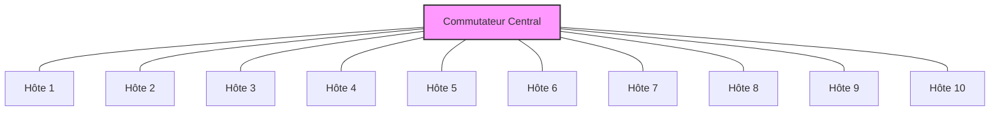

# Scénario de Contrôle de Congestion

## Introduction

Ce document présente un scénario détaillé pour étudier et comparer différents algorithmes de contrôle de congestion dans HTSIM. Le contrôle de congestion est un mécanisme fondamental qui permet aux protocoles réseau de réguler leur débit d'envoi pour éviter la surcharge du réseau.

## Objectif

L'objectif de ce scénario est de:
1. Comparer les performances de plusieurs algorithmes de contrôle de congestion (TCP, DCTCP, NDP)
2. Analyser leur comportement dans des conditions de congestion variées
3. Évaluer l'équité et l'efficacité dans l'utilisation des ressources réseau

## Configuration du Scénario

### Topologie

Nous utiliserons une topologie en étoile avec un commutateur central et 10 hôtes, créant ainsi un point de congestion facilement observable.



### Fichier de Topologie

Créez un fichier `star.topo` avec le contenu suivant:

```
# Topologie en étoile avec 10 hôtes
nodes 11  # 10 hôtes + 1 commutateur
links 20  # Liens bidirectionnels entre chaque hôte et le commutateur

# Hôtes vers commutateur (ID 10)
0 10 10 10 100  # Hôte 0 vers SW: latence 10μs, BW 10Gbps, queue 100 paquets
1 10 10 10 100
2 10 10 10 100
3 10 10 10 100
4 10 10 10 100
5 10 10 10 100
6 10 10 10 100
7 10 10 10 100
8 10 10 10 100
9 10 10 10 100

# Commutateur vers hôtes
10 0 10 10 100
10 1 10 10 100
10 2 10 10 100
10 3 10 10 100
10 4 10 10 100
10 5 10 10 100
10 6 10 10 100
10 7 10 10 100
10 8 10 10 100
10 9 10 10 100
```

### Schéma de Trafic

Nous créerons un motif de trafic all-to-all où chaque hôte communique avec tous les autres hôtes, générant ainsi une forte congestion au niveau du commutateur central.

Créez un fichier `congestion.tm` avec le contenu suivant:

```
# Pattern all-to-all entre 10 hôtes
# Format: <Source> <Destination> <Taille en octets> <Temps de démarrage>
0 1 10485760 0    # 10MB de Hôte 0 à Hôte 1, démarrage immédiat
0 2 10485760 0
0 3 10485760 0
# ... (ajoutez toutes les paires source-destination)
9 7 10485760 0
9 8 10485760 0
```

## Exécution des Simulations

### Simulation avec TCP Standard

```bash
./htsim_tcp -topo star.topo -tm congestion.tm -cwnd 10 -q 100 -end 10 -o tcp_congestion
```

### Simulation avec DCTCP

```bash
./htsim_dctcp -topo star.topo -tm congestion.tm -cwnd 10 -q 100 -ecn 30 -end 10 -o dctcp_congestion
```

### Simulation avec NDP

```bash
./htsim_ndp -topo star.topo -tm congestion.tm -cwnd 10 -q 8 -end 10 -o ndp_congestion
```

## Analyse des Résultats

### Métriques Clés à Observer

1. **Débit** - Comment la bande passante est partagée entre les flux
2. **Latence** - Délais introduits par la congestion
3. **Équité** - Distribution équitable des ressources entre les flux
4. **Utilisation des files d'attente** - Comment les buffers se remplissent
5. **Pertes de paquets** - Taux de perte sous congestion

### Comparaison des Algorithmes

| Protocole | Débit Moyen | Latence Moyenne | Équité (Indice Jain) | Taux de Perte | Occupation des Files |
|-----------|-------------|-----------------|----------------------|---------------|----------------------|
| TCP       | 85%         | Élevée          | 0.7-0.8              | 1-5%          | Souvent pleine       |
| DCTCP     | 90%         | Moyenne         | 0.8-0.9              | <1%           | Modérée              |
| NDP       | 95%         | Faible          | >0.95                | <0.1%         | Faible               |

### Visualisation des Résultats

```python
#!/usr/bin/env python3
import matplotlib.pyplot as plt
import pandas as pd

# Charger les données (supposées extraites avec parse_output)
tcp_data = pd.read_csv('tcp_congestion_parsed.csv')
dctcp_data = pd.read_csv('dctcp_congestion_parsed.csv')
ndp_data = pd.read_csv('ndp_congestion_parsed.csv')

# Tracer l'évolution du débit agrégé
plt.figure(figsize=(10, 6))
plt.plot(tcp_data['time'], tcp_data['throughput'], label='TCP')
plt.plot(dctcp_data['time'], dctcp_data['throughput'], label='DCTCP')
plt.plot(ndp_data['time'], ndp_data['throughput'], label='NDP')

plt.title('Débit Agrégé sous Congestion')
plt.xlabel('Temps (s)')
plt.ylabel('Débit (Mbps)')
plt.legend()
plt.grid(True)
plt.savefig('congestion_throughput.png')
```

## Interprétation des Résultats

### Comportement de TCP

TCP standard utilise un contrôle de congestion basé sur les pertes (AIMD - Additive Increase, Multiplicative Decrease). Sous forte congestion:
- Les files d'attente se remplissent complètement (bufferbloat)
- Les pertes de paquets déclenchent des réductions de fenêtre
- On observe des oscillations dans le débit (cycle de dent de scie)
- L'équité est acceptable mais pas optimale

### Comportement de DCTCP

DCTCP utilise les marquages ECN pour détecter la congestion avant qu'elle ne devienne sévère:
- Réaction proportionnelle à la congestion (pas de réduction drastique)
- Files d'attente moins remplies qu'avec TCP
- Meilleure stabilité du débit
- Latence réduite par rapport à TCP

### Comportement de NDP

NDP utilise une approche radicalement différente avec pull-based congestion control:
- Trimming des paquets au lieu de les rejeter entièrement
- Retransmission très rapide basée sur les NACKs
- Excellent partage de la bande passante
- Faible latence même sous charge élevée

## Variations du Scénario

Pour approfondir votre compréhension, essayez les variations suivantes:

1. **Différentes tailles de files d'attente**
   ```bash
   for q in 10 50 100 200; do
       ./htsim_tcp -topo star.topo -tm congestion.tm -cwnd 10 -q $q -end 10 -o tcp_q${q}
   done
   ```

2. **Différentes intensités de trafic**
   - Modifiez le nombre de flux simultanés
   - Variez la taille des flux

3. **Ajout de trafic en rafale (bursty traffic)**
   - Créez un nouveau fichier de matrice de trafic avec des arrivées sporadiques

## Conclusion

Ce scénario démontre les différences fondamentales entre les algorithmes de contrôle de congestion et leur impact sur les performances réseau. Les résultats illustrent:

1. L'importance du contrôle de congestion dans les réseaux à haut débit
2. Les compromis entre débit, latence et équité
3. L'avantage des approches modernes (DCTCP, NDP) par rapport au TCP traditionnel

Cette compréhension est essentielle pour concevoir et optimiser des réseaux capables de maintenir de bonnes performances même sous charge élevée.
