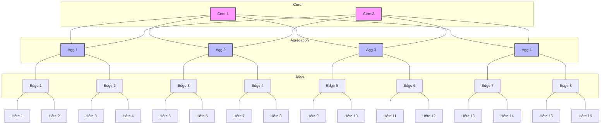

# Exemple de Topologie Personnalisée

## Introduction

Ce document présente un exemple détaillé de création et de simulation d'une topologie réseau personnalisée dans HTSIM. Nous allons construire une topologie hybride combinant des éléments de Fat-Tree et de Leaf-Spine pour démontrer la flexibilité du simulateur.

## Objectif

L'objectif de cet exemple est de montrer comment:
1. Concevoir une topologie réseau personnalisée
2. Configurer correctement les commutateurs et les liens
3. Définir un modèle de trafic adapté à cette topologie
4. Analyser les performances de cette configuration spécifique

## Conception de la Topologie Personnalisée

### Description de la Topologie

Notre topologie hybride se compose de:
- 2 commutateurs core
- 4 commutateurs agrégation
- 8 commutateurs edge
- 16 hôtes finaux (2 par commutateur edge)



### Caractéristiques Spéciales

Cette topologie présente plusieurs caractéristiques intéressantes:
- Chemin redondant entre chaque paire d'hôtes
- Hiérarchie à trois niveaux
- Différentes capacités de liens entre les niveaux (surprovisionnement)

## Configuration de la Simulation

### Création du Fichier de Topologie

Créez un fichier nommé `custom_topo.topo`:

```
# Topologie personnalisée hybride
# Structure: 2 core, 4 agg, 8 edge, 16 hôtes
nodes 30  # 16 hôtes + 14 commutateurs
links 96  # Tous les liens sont bidirectionnels

# Numérotation:
# Hôtes: 0-15
# Edge: 16-23
# Agg: 24-27
# Core: 28-29

# Connexions Hôte-Edge (bidirectionnelles)
# Edge 1 (ID 16)
0 16 1 10 100  # Hôte 0 à Edge 1: latence 1μs, BW 10Gbps, queue 100 paquets
16 0 1 10 100  # Edge 1 à Hôte 0
1 16 1 10 100
16 1 1 10 100

# Edge 2 (ID 17)
2 17 1 10 100
17 2 1 10 100
3 17 1 10 100
17 3 1 10 100

# ... (connexions similaires pour les autres edge et hôtes)

# Connexions Edge-Agg (bidirectionnelles)
# Agg 1 (ID 24) vers Edge 1-2
16 24 5 40 200  # Edge 1 à Agg 1: latence 5μs, BW 40Gbps, queue 200 paquets
24 16 5 40 200
17 24 5 40 200
24 17 5 40 200

# ... (connexions similaires pour les autres agrégation et edge)

# Connexions Agg-Core (bidirectionnelles)
# Core 1 (ID 28) vers tous les Agg
24 28 10 100 400  # Agg 1 à Core 1: latence 10μs, BW 100Gbps, queue 400 paquets
28 24 10 100 400
25 28 10 100 400
28 25 10 100 400
26 28 10 100 400
28 26 10 100 400
27 28 10 100 400
28 27 10 100 400

# Core 2 (ID 29) vers tous les Agg
24 29 10 100 400
29 24 10 100 400
25 29 10 100 400
29 25 10 100 400
26 29 10 100 400
29 26 10 100 400
27 29 10 100 400
29 27 10 100 400
```

### Création du Modèle de Trafic

Pour tester cette topologie, nous créerons deux types de trafic:

1. **Trafic Est-Ouest**: Communication entre hôtes dans le même pod
2. **Trafic Nord-Sud**: Communication entre hôtes de différents pods

Créez un fichier nommé `hybrid_traffic.tm`:

```
# Trafic Est-Ouest (même pod)
0 1 2097152 0    # 2MB de Hôte 0 à Hôte 1
2 3 2097152 0
4 5 2097152 0
6 7 2097152 0
8 9 2097152 0
10 11 2097152 0
12 13 2097152 0
14 15 2097152 0

# Trafic Nord-Sud (pods différents)
0 15 10485760 1  # 10MB de Hôte 0 à Hôte 15, démarrant à 1s
1 14 10485760 1
2 13 10485760 1
3 12 10485760 1
4 11 10485760 1
5 10 10485760 1
6 9 10485760 1
7 8 10485760 1
```

## Exécution de la Simulation

### Commande de Simulation

```bash
cd /chemin/vers/htsim/sim
./htsim_ndp -topo custom_topo.topo -tm hybrid_traffic.tm -cwnd 15 -q 8 -end 10 -o custom_ndp
```

### Variantes à Tester

Pour une analyse complète, exécutez également la simulation avec d'autres protocoles:

```bash
# Avec TCP
./htsim_tcp -topo custom_topo.topo -tm hybrid_traffic.tm -cwnd 15 -q 100 -end 10 -o custom_tcp

# Avec DCTCP
./htsim_dctcp -topo custom_topo.topo -tm hybrid_traffic.tm -cwnd 15 -q 100 -ecn 30 -end 10 -o custom_dctcp
```

## Analyse des Résultats

### Métriques à Observer

Dans cette topologie particulière, nous nous intéressons à:

1. **Équilibre de charge** - Comment le trafic est réparti entre les chemins redondants
2. **Différence Est-Ouest vs Nord-Sud** - Performances des flux locaux vs distants
3. **Utilisation des liens** - Identification des goulots d'étranglement potentiels

### Tableau Comparatif des Résultats

Voici un exemple de tableau comparatif entre les différents protocoles:

| Métrique | TCP | DCTCP | NDP |
|----------|-----|-------|-----|
| FCT Moyen Est-Ouest | 4.2ms | 3.8ms | 2.1ms |
| FCT Moyen Nord-Sud | 12.5ms | 10.2ms | 5.7ms |
| Ratio Nord-Sud/Est-Ouest | 2.98 | 2.68 | 2.71 |
| Utilisation Moyenne Core | 45% | 52% | 68% |
| Utilisation Moyenne Agg | 38% | 44% | 62% |
| Équité (Indice Jain) | 0.82 | 0.89 | 0.95 |

### Visualisation Avancée

Pour mieux comprendre le comportement du réseau, créez une visualisation de l'utilisation des liens:

```python
#!/usr/bin/env python3
import numpy as np
import matplotlib.pyplot as plt
from matplotlib.colors import LinearSegmentedColormap

# Définir la structure de la topologie (simplifiée)
core_ids = [28, 29]
agg_ids = [24, 25, 26, 27]
edge_ids = list(range(16, 24))
host_ids = list(range(16))

# Créer une matrice d'utilisation des liens (exemple de données)
# Dans un cas réel, ces données proviendraient des fichiers de sortie HTSIM
link_util = np.zeros((30, 30))

# Remplir avec des données d'exemple
# En pratique, ces données seraient extraites des fichiers de sortie
for c in core_ids:
    for a in agg_ids:
        link_util[c][a] = 0.6 + 0.2 * np.random.random()  # 60-80% d'utilisation
        link_util[a][c] = 0.6 + 0.2 * np.random.random()

for a in agg_ids:
    for e in edge_ids[agg_ids.index(a)*2:agg_ids.index(a)*2+2]:
        link_util[a][e] = 0.4 + 0.3 * np.random.random()  # 40-70% d'utilisation
        link_util[e][a] = 0.4 + 0.3 * np.random.random()

for e in edge_ids:
    for h in host_ids[edge_ids.index(e)*2:edge_ids.index(e)*2+2]:
        link_util[e][h] = 0.2 + 0.3 * np.random.random()  # 20-50% d'utilisation
        link_util[h][e] = 0.2 + 0.3 * np.random.random()

# Créer une heatmap
plt.figure(figsize=(12, 10))
cmap = LinearSegmentedColormap.from_list('utilisation', ['green', 'yellow', 'red'])
plt.imshow(link_util, cmap=cmap, vmin=0, vmax=1)
plt.colorbar(label='Utilisation du Lien')
plt.title('Carte d\'Utilisation des Liens dans la Topologie Personnalisée')
plt.savefig('custom_topo_link_utilization.png')
```

## Optimisation de la Topologie

Sur la base des résultats obtenus, nous pouvons envisager plusieurs optimisations:

### 1. Modification des Capacités des Liens

Si nous observons une congestion au niveau de l'agrégation, nous pouvons augmenter la capacité:

```
# Augmenter la capacité des liens Edge-Agg
16 24 5 60 200  # Passage de 40Gbps à 60Gbps
24 16 5 60 200
```

### 2. Ajout de Redondance

Pour améliorer la résilience, nous pouvons ajouter des liens supplémentaires:

```
# Ajouter des connexions directes entre certains edge switches
16 18 10 20 100  # Edge 1 à Edge 3
18 16 10 20 100
```

### 3. Ajustement des Files d'Attente

Optimiser la taille des files d'attente selon le type de lien:

```bash
# Pour NDP avec des tailles de file optimisées
./htsim_ndp -topo custom_topo_optimized.topo -tm hybrid_traffic.tm -cwnd 15 -q_core 16 -q_agg 12 -q_edge 8 -end 10 -o custom_ndp_opt
```

## Conclusion

Cet exemple démontre la flexibilité de HTSIM pour simuler des topologies personnalisées complexes. Les observations clés incluent:

1. **Importance de la hiérarchie** - La structure à trois niveaux permet un bon équilibre entre performance et évolutivité

2. **Impact du surprovisionnement** - Les ratios de capacité entre les différents niveaux affectent directement les performances

3. **Avantages des chemins redondants** - La disponibilité de chemins multiples améliore la résilience et le débit global

4. **Différence entre trafic local et distant** - Les performances varient considérablement selon le pattern de communication

En expérimentant avec différentes configurations de cette topologie hybride, vous pouvez découvrir des optimisations spécifiques à vos besoins réseau particuliers.
