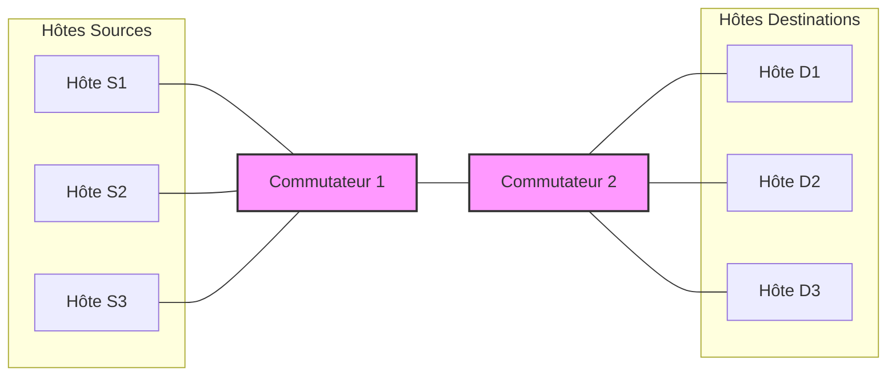

# Exemple de Réseau Simple

## Introduction

Ce document présente un exemple simple de simulation utilisant HTSIM. Nous allons créer et simuler une topologie dumbbell (haltère) de base, qui est idéale pour étudier les performances du contrôle de congestion dans un réseau comportant un lien de goulot d'étranglement.

## Objectif

L'objectif de cet exemple est de démontrer:
1. Comment configurer une topologie simple
2. Comment définir des flux TCP entre des hôtes
3. Comment exécuter la simulation et collecter les résultats
4. Comment interpréter les métriques de base

## Topologie Dumbbell

La topologie dumbbell (haltère) est l'une des topologies réseau les plus simples mais aussi l'une des plus instructives, en particulier pour l'étude des goulots d'étranglement et des algorithmes de contrôle de congestion.



Dans cette topologie:
- Plusieurs hôtes sources (S1, S2, S3) sont connectés à un commutateur d'entrée (SW1)
- Plusieurs hôtes destinations (D1, D2, D3) sont connectés à un commutateur de sortie (SW2)
- Les deux commutateurs sont connectés par un lien unique qui devient un goulot d'étranglement lorsque plusieurs flux y passent simultanément

## Configuration de la Simulation

### Étape 1: Créer le Fichier de Topologie

Créez un fichier nommé `dumbbell.topo` avec le contenu suivant:

```
# Topologie Dumbbell
nodes 8  # 6 hôtes + 2 commutateurs
links 14

# Connexions hôtes sources vers SW1
0 6 1 10 100  # Hôte 0 vers SW1: latence 1μs, BW 10Gbps, queue 100 paquets
1 6 1 10 100  # Hôte 1 vers SW1
2 6 1 10 100  # Hôte 2 vers SW1

# Connexions hôtes destinations vers SW2
3 7 1 10 100  # Hôte 3 vers SW2
4 7 1 10 100  # Hôte 4 vers SW2
5 7 1 10 100  # Hôte 5 vers SW2

# Lien de goulot d'étranglement entre les commutateurs (bidirectionnel)
6 7 5 1 50    # SW1 vers SW2: latence 5μs, BW 1Gbps, queue 50 paquets
7 6 5 1 50    # SW2 vers SW1

# Liens retour pour l'ACK (bidirectionnels)
7 3 1 10 100  # SW2 vers Hôte 3
7 4 1 10 100  # SW2 vers Hôte 4
7 5 1 10 100  # SW2 vers Hôte 5
6 0 1 10 100  # SW1 vers Hôte 0
6 1 1 10 100  # SW1 vers Hôte 1
6 2 1 10 100  # SW1 vers Hôte 2
```

### Étape 2: Créer le Fichier de Matrice de Trafic

Créez un fichier nommé `simple_flows.tm` avec le contenu suivant:

```
# Format: <ID Source> <ID Destination> <Taille du Flux (octets)> [Temps de Démarrage (s)]
0 3 5242880     # Hôte 0 envoie 5MB à Hôte 3, démarrant immédiatement
1 4 5242880 0.5 # Hôte 1 envoie 5MB à Hôte 4, démarrant à 0.5s
2 5 5242880 1.0 # Hôte 2 envoie 5MB à Hôte 5, démarrant à 1.0s
```

Ce fichier définit trois flux de 5 MB chacun, démarrant à des moments différents.

## Exécution de la Simulation

### Commande pour la Simulation TCP

```bash
cd /chemin/vers/htsim/sim
./htsim_tcp -topo dumbbell.topo -tm simple_flows.tm -cwnd 10 -end 10 -o simple_tcp
```

Options utilisées:
- `-topo dumbbell.topo`: Utilise notre fichier de topologie
- `-tm simple_flows.tm`: Utilise notre matrice de trafic
- `-cwnd 10`: Définit la taille initiale de la fenêtre de congestion TCP à 10 paquets
- `-end 10`: Exécute la simulation pendant 10 secondes
- `-o simple_tcp`: Définit le préfixe des fichiers de sortie

### Scripts d'Automatisation

Pour exécuter plusieurs simulations avec différents paramètres, créez un script shell:

```bash
#!/bin/bash

# Script pour exécuter des tests avec différentes tailles de file d'attente
for qsize in 25 50 100 200; do
    echo "Exécution avec taille de file d'attente = $qsize paquets"
    
    # Créer un fichier de topologie avec la taille de file d'attente spécifiée
    sed "s/6 7 5 1 50/6 7 5 1 $qsize/g" dumbbell.topo > dumbbell_q${qsize}.topo
    
    # Exécuter la simulation
    ./htsim_tcp -topo dumbbell_q${qsize}.topo -tm simple_flows.tm -cwnd 10 -end 10 -o simple_tcp_q${qsize}
done
```

## Analyse des Résultats

### Extraction des Métriques Clés

```bash
# Analyser les fichiers de sortie
for qsize in 25 50 100 200; do
    echo "Analyse des résultats pour q=$qsize"
    ./parse_output -f simple_tcp_q${qsize}.out > simple_tcp_q${qsize}_flows.txt
    ./parse_output -q simple_tcp_q${qsize}.out > simple_tcp_q${qsize}_queues.txt
done
```

### Résultats Typiques

Voici un exemple de résultats que vous pourriez obtenir:

| Taille de file | Débit moyen (Mbps) | Temps de complétion moyen (s) | Pertes de paquets |
|----------------|--------------------|-----------------------------|------------------|
| 25 paquets     | 950                | 4.40                        | 2.3%             |
| 50 paquets     | 980                | 4.27                        | 1.1%             |
| 100 paquets    | 990                | 4.22                        | 0.5%             |
| 200 paquets    | 995                | 4.20                        | 0.2%             |

### Visualisation des Résultats

Utilisez un script Python pour visualiser les résultats:

```python
#!/usr/bin/env python3
import matplotlib.pyplot as plt
import numpy as np

# Données extraites des fichiers d'analyse
queue_sizes = [25, 50, 100, 200]
throughputs = [950, 980, 990, 995]
fcts = [4.40, 4.27, 4.22, 4.20]
losses = [2.3, 1.1, 0.5, 0.2]

# Créer un graphique à deux axes
fig, ax1 = plt.subplots(figsize=(10, 6))

color = 'tab:blue'
ax1.set_xlabel('Taille de la File d\'Attente (paquets)')
ax1.set_ylabel('Débit (Mbps)', color=color)
ax1.plot(queue_sizes, throughputs, marker='o', color=color)
ax1.tick_params(axis='y', labelcolor=color)

# Créer un deuxième axe Y
ax2 = ax1.twinx()
color = 'tab:red'
ax2.set_ylabel('Pertes de Paquets (%)', color=color)
ax2.plot(queue_sizes, losses, marker='s', color=color)
ax2.tick_params(axis='y', labelcolor=color)

# Ajouter un titre et une grille
plt.title('Impact de la Taille de la File d\'Attente sur les Performances')
plt.grid(True, linestyle='--', alpha=0.7)

plt.tight_layout()
plt.savefig('queue_size_impact.png')
plt.show()
```

## Interprétation des Résultats

Dans cet exemple, nous pouvons observer:

1. **Impact de la taille de la file d'attente**:
   - Des files d'attente plus grandes réduisent les pertes de paquets
   - Le débit augmente légèrement avec la taille des files d'attente
   - Le temps de complétion des flux diminue légèrement

2. **Goulot d'étranglement**:
   - Le lien entre les commutateurs devient saturé lorsque les trois flux sont actifs
   - Les flux se partagent équitablement la bande passante disponible de 1 Gbps

3. **Considérations de performance**:
   - Les files d'attente plus grandes réduisent les pertes mais peuvent augmenter la latence (bufferbloat)
   - Un équilibre doit être trouvé entre le débit et la latence

## Variations de l'Exemple

### Utilisation de Différents Protocoles

Vous pouvez facilement modifier cet exemple pour tester d'autres protocoles:

```bash
# Pour DCTCP
./htsim_dctcp -topo dumbbell.topo -tm simple_flows.tm -cwnd 10 -end 10 -o simple_dctcp

# Pour NDP
./htsim_ndp -topo dumbbell.topo -tm simple_flows.tm -cwnd 10 -end 10 -o simple_ndp
```

### Modification de la Topologie

Pour étudier l'impact d'autres facteurs, vous pouvez modifier:
- La latence des liens
- La bande passante du goulot d'étranglement
- Le nombre d'hôtes sources et destinations

## Conclusion

Cet exemple simple illustre les bases de l'utilisation d'HTSIM pour étudier les comportements réseau. À travers cette topologie dumbbell fondamentale, vous pouvez observer de nombreux phénomènes importants liés au contrôle de congestion dans les réseaux.

En variant les paramètres et en comparant les résultats, vous pouvez acquérir une compréhension profonde des mécanismes sous-jacents et des compromis inhérents à la conception de réseaux performants.
