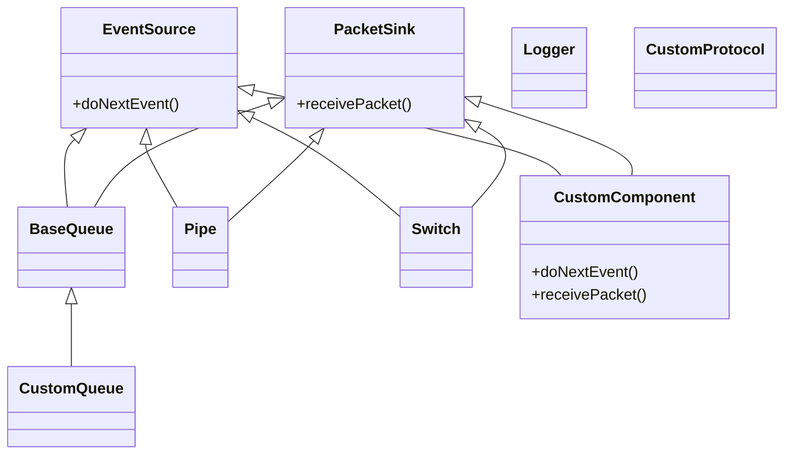

# Personnalisation de HTSIM

## Introduction

HTSIM est conçu comme un simulateur modulaire et extensible. Cette section explique comment personnaliser et étendre les fonctionnalités de HTSIM pour répondre à vos besoins spécifiques de recherche ou d'analyse réseau.

## Avantages de la Personnalisation

La personnalisation de HTSIM vous permet de:
- Implémenter de nouveaux protocoles de contrôle de congestion
- Créer des modèles de commutation spécifiques
- Ajouter des mécanismes de gestion de file d'attente innovants
- Intégrer des générateurs de trafic personnalisés
- Développer des métriques et des outils d'analyse sur mesure

## Architecture Extensible



L'architecture de HTSIM facilite l'extensibilité grâce à:
- Des interfaces bien définies comme `EventSource` et `PacketSink`
- Un mécanisme d'événements discrets standardisé
- Une séparation claire entre la logique de transport et la logique réseau
- Un système modulaire de composants interconnectables

## Types de Personnalisations Courants

### 1. Création d'un Nouveau Protocole

Pour implémenter un nouveau protocole de contrôle de congestion:

1. Créez une nouvelle classe dérivée de `TcpSrc` ou directement de `BaseQueue`:

```cpp
// MonProtocole.h
#ifndef MONPROTOCOLE_H
#define MONPROTOCOLE_H

#include "tcp.h"

class MonProtocoleSrc : public TcpSrc {
private:
    // Variables d'état spécifiques à votre protocole
    double _mon_parametre;
    
public:
    // Constructeur
    MonProtocoleSrc(TrafficLogger* logger, ...);
    
    // Fonctions à surcharger
    virtual void receivePacket(Packet& pkt);
    virtual void receiveACK(const MonProtocoleAck& ack);
    virtual void handleTimeout();
    
    // Méthodes spécifiques à votre protocole
    void monAlgorithmeSpecifique();
};

// Classe de paquet ACK spécifique si nécessaire
class MonProtocoleAck : public TcpAck {
    // ...
};

#endif
```

```cpp
// MonProtocole.cpp
#include "MonProtocole.h"

MonProtocoleSrc::MonProtocoleSrc(TrafficLogger* logger, ...) 
    : TcpSrc(logger, ...), _mon_parametre(1.0) {
    // Initialisation
}

void MonProtocoleSrc::receivePacket(Packet& pkt) {
    // Traitement des paquets reçus
}

void MonProtocoleSrc::receiveACK(const MonProtocoleAck& ack) {
    // Mise à jour de la fenêtre de congestion selon votre algorithme
    _cwnd = /* votre logique de mise à jour */;
    
    // Appel à votre algorithme spécifique
    monAlgorithmeSpecifique();
    
    // Envoi de nouveaux paquets si possible
    sendPackets();
}

void MonProtocoleSrc::handleTimeout() {
    // Gestion des timeouts selon votre protocole
}

void MonProtocoleSrc::monAlgorithmeSpecifique() {
    // Implémentation de votre algorithme spécifique
}
```

2. Créez un point d'entrée principal pour tester votre protocole:

```cpp
// main_monprotocole.cpp
#include "main.h"
#include "MonProtocole.h"

// Fonction similaire à la fonction main standard mais adaptée à votre protocole
int main(int argc, char **argv) {
    // Initialisation, parsing des arguments, etc.
    
    // Création des sources utilisant votre protocole
    MonProtocoleSrc* src = new MonProtocoleSrc(...);
    
    // Création et configuration de la topologie
    
    // Exécution de la simulation
    run_simulation();
    
    // Nettoyage
    cleanup();
    
    return 0;
}
```

3. Ajoutez votre nouveau protocole au Makefile:

```makefile
# Ajout à Makefile
htsim_monprotocole: $(OBJS) MonProtocole.o main_monprotocole.o
	$(CC) $(CFLAGS) $(OBJS) MonProtocole.o main_monprotocole.o -o htsim_monprotocole
```

### 2. Création d'une Nouvelle File d'Attente

Pour implémenter un nouvel algorithme de gestion de file d'attente:

```cpp
// MaFile.h
#ifndef MAFILE_H
#define MAFILE_H

#include "queue.h"

class MaFile : public Queue {
private:
    // Paramètres spécifiques
    double _mon_seuil_adaptatif;
    
public:
    MaFile(linkspeed_bps bitrate, mem_b maxsize, ...);
    
    // Surcharger les méthodes de gestion des paquets
    virtual void enqueue(Packet& pkt);
    virtual Packet* dequeue();
    
    // Méthodes spécifiques à votre algorithme
    void ajusterSeuilAdaptatif();
};

#endif
```

```cpp
// MaFile.cpp
#include "MaFile.h"

MaFile::MaFile(linkspeed_bps bitrate, mem_b maxsize, ...)
    : Queue(bitrate, maxsize), _mon_seuil_adaptatif(0.5 * maxsize) {
    // Initialisation
}

void MaFile::enqueue(Packet& pkt) {
    // Logique de décision (accepter/rejeter/marquer)
    if (queuesize() > _mon_seuil_adaptatif) {
        // Logique de rejet ou marquage
        if (/* condition */) {
            drop(&pkt);
            return;
        }
        // Ou marquage ECN
        pkt.set_flags(ECN_CE);
    }
    
    // Logique d'insertion dans la file
    Queue::enqueue(pkt);
    
    // Mise à jour de l'algorithme adaptatif
    ajusterSeuilAdaptatif();
}

Packet* MaFile::dequeue() {
    // Logique de service personnalisée si nécessaire
    return Queue::dequeue();
}

void MaFile::ajusterSeuilAdaptatif() {
    // Implémentation de votre algorithme adaptatif
    _mon_seuil_adaptatif = /* nouvelle valeur */;
}
```

### 3. Création d'un Nouveau Modèle de Trafic

Pour implémenter un générateur de trafic personnalisé:

```cpp
// MonGenerateur.h
#include "traffic-generator.h"

class MonGenerateurTrafic : public TrafficGenerator {
private:
    // Paramètres du modèle
    double _parametre_forme;
    double _intensite_moyenne;
    
public:
    MonGenerateurTrafic(double intensite, double forme);
    
    // Méthodes principales
    virtual void start();
    virtual void stop();
    
    // Méthodes spécifiques
    double genererTailleFlux();
    simtime_picosec genererTempsInterArrivee();
    
    // Gestion des événements
    void creerNouveauFlux();
};
```

## Guide Étape par Étape pour la Personnalisation

### Étape 1: Comprendre l'Architecture HTSIM

Avant de commencer toute personnalisation, familiarisez-vous avec:
- Le système d'événements discrets
- Les interfaces PacketSink et EventSource
- Le cycle de vie des paquets
- Les mécanismes d'enregistrement des données

### Étape 2: Identifier le Point d'Extension

Déterminez précisément quel aspect vous souhaitez personnaliser:
- Protocole de transport (TCP, NDP, etc.)
- Mécanisme de file d'attente
- Topologie réseau
- Collecte de métriques

### Étape 3: Créer les Nouvelles Classes

1. Identifiez la classe de base appropriée
2. Héritez de cette classe
3. Surchargez les méthodes nécessaires
4. Ajoutez vos fonctionnalités spécifiques

### Étape 4: Intégrer dans le Système de Compilation

Modifiez le Makefile pour inclure vos nouveaux fichiers:

```makefile
# Ajouter vos fichiers .o à la liste des objets
OBJS += MonProtocole.o MaFile.o MonGenerateur.o

# Ajouter une règle pour votre exécutable
htsim_monprotocole: $(OBJS) main_monprotocole.o
	$(CC) $(CFLAGS) $(OBJS) main_monprotocole.o -o htsim_monprotocole
```

### Étape 5: Tester Votre Extension

1. Commencez avec des cas simples et des topologies minimalistes
2. Validez le comportement de base
3. Augmentez progressivement la complexité des tests
4. Comparez avec des implémentations existantes

## Exemples Concrets de Personnalisation

### Exemple 1: Protocole avec Détection Précoce de Congestion

Un protocole qui réagit à la congestion avant même de recevoir des ACK marqués ECN:

```cpp
class ProactiveCongestControl : public TcpSrc {
private:
    double _trend_estimator;
    
public:
    ProactiveCongestControl(...) : TcpSrc(...), _trend_estimator(0) {}
    
    virtual void receiveACK(const TcpAck& ack) {
        // Calculer la tendance de l'évolution du RTT
        simtime_picosec current_rtt = /* calculer RTT actuel */;
        _trend_estimator = 0.9 * _trend_estimator + 0.1 * (current_rtt - _base_rtt);
        
        // Réduire la fenêtre de façon proactive si la tendance augmente
        if (_trend_estimator > _threshold) {
            _cwnd = _cwnd * 0.95;  // Réduction progressive
        } else {
            // Augmentation normale
            _cwnd += 1/_cwnd;
        }
        
        // Suite du traitement normal
        TcpSrc::receiveACK(ack);
    }
};
```

### Exemple 2: File d'Attente à Priorité Dynamique

Une file d'attente qui ajuste dynamiquement les priorités des flux:

```cpp
class DynamicPrioQueue : public PriorityQueue {
private:
    std::map<uint32_t, double> _flow_rates;  // Taux par flux
    
public:
    DynamicPrioQueue(...) : PriorityQueue(...) {}
    
    virtual void enqueue(Packet& pkt) {
        // Identifier le flux
        uint32_t flow_id = pkt.flow_id();
        
        // Mettre à jour le taux du flux
        _flow_rates[flow_id] = /* calcul du nouveau taux */;
        
        // Ajuster la priorité en fonction du taux
        // Les petits flux reçoivent une priorité plus élevée
        int priority;
        if (_flow_rates[flow_id] < _small_flow_threshold)
            priority = HIGH_PRIO;
        else
            priority = LOW_PRIO;
        
        // Enqueue avec la priorité calculée
        PriorityQueue::enqueue(pkt, priority);
    }
};
```

## Bonnes Pratiques pour l'Extension de HTSIM

1. **Maintenez la compatibilité** - Assurez-vous que vos extensions fonctionnent avec le reste du système

2. **Réutilisez le code existant** - Héritez des classes existantes et ne réimplémentez que ce qui est nécessaire

3. **Documentez vos extensions** - Ajoutez des commentaires détaillés expliquant vos algorithmes et hypothèses

4. **Tests progressifs** - Testez chaque modification progressivement

5. **Benchmarking** - Comparez toujours avec une référence connue pour valider vos résultats

6. **Gestion des paramètres** - Rendez vos extensions configurables via des paramètres en ligne de commande

7. **Optimisation** - Gardez à l'esprit l'efficacité, en particulier pour les simulations à grande échelle

## Limites et Considérations

Lors de la personnalisation de HTSIM, soyez conscient des limitations:

- **Compatibilité versions** - Les mises à jour de HTSIM peuvent nécessiter des adaptations de vos extensions
- **Interactions complexes** - Les interactions entre différents composants personnalisés peuvent être difficiles à prévoir
- **Performance** - Des extensions complexes peuvent ralentir considérablement la simulation
- **Validité** - Validez soigneusement que vos extensions modélisent correctement le comportement réel que vous souhaitez étudier

## Contribution au Projet HTSIM

Si vous développez une extension utile, envisagez de contribuer au projet principal:

1. Assurez-vous que votre code est bien documenté et testé
2. Créez une demande de pull sur le dépôt GitHub
3. Incluez des exemples et des cas de test
4. Expliquez clairement la motivation et les avantages de votre extension
