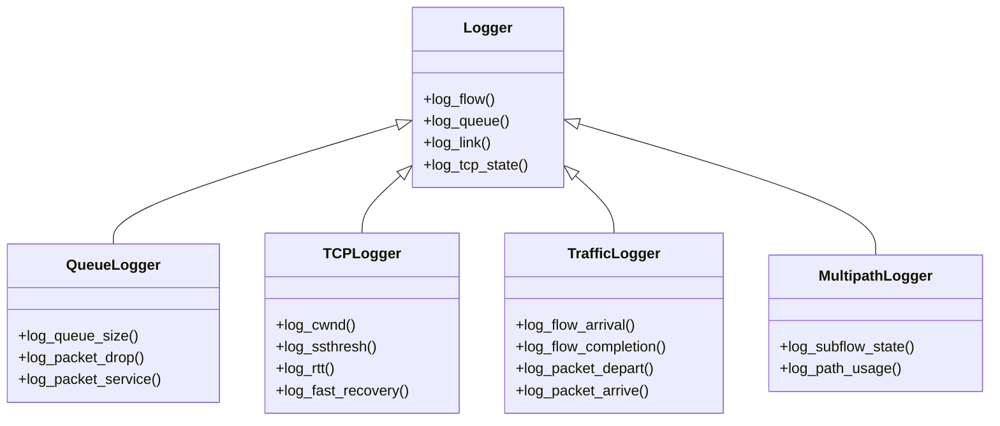

# Débogage et Journalisation

## Introduction

Le débogage et la journalisation sont des aspects essentiels lors de l'utilisation et du développement avec HTSIM. Cette section explique comment utiliser efficacement les fonctionnalités de journalisation intégrées, comment déboguer les simulations problématiques et comment mettre en place une stratégie de surveillance pour les simulations complexes.

## Système de Journalisation dans HTSIM

HTSIM dispose d'un système de journalisation flexible qui permet de capturer diverses métriques et événements pendant la simulation.

### Types de Loggers



### Configuration de la Journalisation

Pour activer la journalisation dans HTSIM, vous pouvez:

1. **Activer la journalisation globale** avec l'option `-o`:
   ```bash
   ./htsim_tcp -topo topology.topo -tm traffic.tm -o log_prefix
   ```

2. **Activer des journalisations spécifiques**:
   ```bash
   ./htsim_tcp -topo topology.topo -tm traffic.tm -o log_prefix -queue_log -tcp_log
   ```

3. **Configurer le niveau de détail**:
   ```bash
   ./htsim_tcp -topo topology.topo -tm traffic.tm -o log_prefix -log_level 3
   ```

### Format des Fichiers de Journal

Les fichiers de journalisation HTSIM sont généralement au format texte ou CSV:

```
# Exemple de fichier de journal de file d'attente (queue_log)
# temps, id_file, taille_file, paquets_arrivés, paquets_servis, paquets_rejetés
0.000100, 1, 5, 10, 5, 0
0.000200, 1, 8, 15, 7, 0
0.000300, 1, 12, 22, 10, 0
0.000400, 1, 20, 30, 10, 0
0.000500, 1, 18, 35, 17, 0
...
```

## Techniques de Débogage

### Débogage Basé sur les Journaux

La méthode la plus simple pour déboguer HTSIM consiste à analyser les fichiers de journalisation:

1. **Activer une journalisation détaillée**:
   ```bash
   ./htsim_tcp -topo topology.topo -tm traffic.tm -o debug_log -log_level 4 -verbose
   ```

2. **Analyser les journaux avec des outils standard**:
   ```bash
   # Rechercher des erreurs ou anomalies
   grep "ERROR" debug_log.out
   
   # Suivre un flux spécifique
   grep "flow_id=42" debug_log_flows.csv > flow42.log
   
   # Visualiser l'évolution temporelle
   awk '{print $1, $3}' debug_log_queues.csv > queue_size_over_time.dat
   ```

### Débogage avec GDB

Pour les problèmes plus complexes, utilisez GDB pour déboguer HTSIM:

1. **Compiler avec les symboles de débogage**:
   ```bash
   make clean
   make CFLAGS="-g -O0"
   ```

2. **Lancer HTSIM avec GDB**:
   ```bash
   gdb --args ./htsim_tcp -topo topology.topo -tm traffic.tm
   ```

3. **Commandes GDB utiles**:
   ```
   (gdb) break TcpSrc::receivePacket  # Point d'arrêt dans une méthode
   (gdb) break main.cpp:246           # Point d'arrêt à une ligne spécifique
   (gdb) run                          # Démarrer la simulation
   (gdb) next                         # Exécuter la ligne suivante
   (gdb) step                         # Entrer dans la fonction
   (gdb) print _cwnd                  # Afficher la valeur d'une variable
   (gdb) watch _queuesize             # Surveiller une variable
   (gdb) backtrace                    # Afficher la pile d'appels
   ```

### Débogage des Problèmes Spécifiques

#### 1. Problèmes de Convergence de Protocole

Pour déboguer les problèmes de convergence des algorithmes de contrôle de congestion:

```bash
# Activer la journalisation détaillée de l'état TCP
./htsim_tcp -topo topology.topo -tm traffic.tm -o convergence_debug -tcp_log -sample 0.0001

# Analyser l'évolution de cwnd
python3 analyze_cwnd.py convergence_debug_tcp_cwnd.csv
```

#### 2. Problèmes de Performance

Pour identifier les goulots d'étranglement de performance:

```bash
# Activer la journalisation des files d'attente et des liens
./htsim_tcp -topo topology.topo -tm traffic.tm -o perf_debug -queue_log -link_log

# Identifier les files d'attente saturées
awk '$3 > 0.9*$4 {print $0}' perf_debug_queues.csv > saturated_queues.log

# Vérifier l'utilisation des liens
awk '{sum+=$3} END {print "Utilisation moyenne:", sum/NR}' perf_debug_links.csv
```

#### 3. Problèmes de Blocage de Simulation

Si la simulation semble bloquée:

```bash
# Lancer avec timeout
timeout 300s ./htsim_tcp -topo topology.topo -tm traffic.tm -o timeout_test

# Si le problème persiste, déboguer avec GDB
gdb --args ./htsim_tcp -topo topology.topo -tm traffic.tm
(gdb) run
# Après quelques minutes, appuyer sur Ctrl+C
(gdb) thread apply all backtrace
```

## Stratégies de Journalisation Avancées

### Journalisation Sélective

Pour les simulations à grande échelle, une journalisation sélective est cruciale:

```bash
# Journaliser uniquement certains flux
./htsim_tcp -topo topology.topo -tm traffic.tm -o selective -log_flows "1,5,10-15"

# Journaliser certaines files d'attente
./htsim_tcp -topo topology.topo -tm traffic.tm -o selective -log_queues "core_switch[0-3]"
```

### Échantillonnage Adaptatif

Pour capturer des événements importants sans générer des fichiers trop volumineux:

```bash
# Échantillonnage standard
./htsim_tcp -topo topology.topo -tm traffic.tm -o adaptive -sample 0.001

# Échantillonnage adaptatif (si implémenté)
./htsim_tcp -topo topology.topo -tm traffic.tm -o adaptive -adaptive_sample -min_sample 0.001 -max_sample 0.1
```

### Journalisation Conditionnelle

Implémentez une journalisation conditionnelle pour capturer des événements spécifiques:

```cpp
// Exemple de code pour une journalisation conditionnelle
if (queue_size > 0.9 * max_queue_size) {
    // Journalisation détaillée uniquement quand la file est presque pleine
    logger->log_detail("Queue nearly full", queue_size, incoming_rate, service_rate);
}
```

## Outils d'Analyse de Journaux

### Analyse en Temps Réel

Pour surveiller des simulations longues en temps réel:

```bash
# Lancer la simulation avec sortie dans un fichier
./htsim_tcp -topo topology.topo -tm traffic.tm -o realtime > simulation.log &

# Suivre la progression en temps réel
tail -f simulation.log

# Surveiller une métrique spécifique en temps réel
tail -f realtime_queues.csv | grep "queue_id=5" | cut -d',' -f1,3 | feedgnuplot --stream --domain --lines
```

### Scripts d'Analyse Post-Simulation

Créez des scripts d'analyse pour traiter les journaux après la simulation:

```python
#!/usr/bin/env python3
import pandas as pd
import matplotlib.pyplot as plt
import sys

# Charger les données
flows_data = pd.read_csv(sys.argv[1])

# Calculer les statistiques par flux
flow_stats = flows_data.groupby('flow_id').agg({
    'throughput': ['mean', 'std', 'max'],
    'rtt': ['mean', 'std', 'max'],
    'cwnd': ['mean', 'std', 'max']
}).reset_index()

# Identifier les flux avec des anomalies
anomalies = flow_stats[flow_stats['throughput']['std'] > 0.3 * flow_stats['throughput']['mean']]
print("Flux avec forte variabilité de débit:")
print(anomalies[['flow_id', 'throughput']])

# Tracer l'évolution des RTT pour ces flux
plt.figure(figsize=(12, 6))
for flow_id in anomalies['flow_id']:
    flow_data = flows_data[flows_data['flow_id'] == flow_id]
    plt.plot(flow_data['time'], flow_data['rtt'], label=f'Flow {flow_id}')

plt.xlabel('Temps (s)')
plt.ylabel('RTT (s)')
plt.title('RTT des flux avec forte variabilité de débit')
plt.legend()
plt.grid(True)
plt.savefig('anomalous_flows_rtt.png')
```

## Résolution des Problèmes Courants

### Problème: Fuites Mémoire

Symptômes:
- Utilisation mémoire croissante
- Ralentissement progressif
- Crash avec "out of memory"

Solution:
```bash
# Compiler avec Address Sanitizer
make clean
make CFLAGS="-g -fsanitize=address"

# Exécuter une simulation courte
./htsim_tcp -topo small.topo -tm small.tm -end 1

# Analyser le rapport d'erreur produit
```

### Problème: Simulation Figée

Symptômes:
- La simulation ne progresse plus
- Aucune sortie pendant une longue période

Solution:
```bash
# Vérifier l'état avec GDB
gdb -p $(pgrep htsim_tcp)
(gdb) thread apply all bt
(gdb) info threads

# Alternative: utiliser strace
strace -p $(pgrep htsim_tcp)
```

### Problème: Résultats Incohérents

Symptômes:
- Variations inexplicables entre les exécutions
- Métriques qui semblent invalides

Solution:
```bash
# Fixer la graine aléatoire
./htsim_tcp -topo topology.topo -tm traffic.tm -seed 12345 -o fixed_seed

# Activer la journalisation détaillée pour validation
./htsim_tcp -topo topology.topo -tm traffic.tm -seed 12345 -o validation -verbose -log_level 4

# Comparer avec une version de référence connue
diff -u reference_results.csv validation_flows.csv
```

## Bonnes Pratiques

### Pour le Débogage

1. **Approche progressive** : Commencez par des scénarios simples pour isoler les problèmes
2. **Journalisation stratégique** : Activez la journalisation seulement pour les composants pertinents
3. **Assertions** : Utilisez des assertions pour vérifier les invariants du code
4. **Reproductibilité** : Fixez toujours une graine aléatoire lors du débogage
5. **Versions intermédiaires** : Sauvegardez l'état à différentes étapes de la simulation

### Pour la Journalisation

1. **Filtrage intelligent** : Journalisez seulement ce qui est nécessaire
2. **Format structuré** : Utilisez des formats faciles à traiter (CSV, JSON)
3. **Horodatage précis** : Incluez toujours des horodatages précis
4. **Contexte** : Incluez suffisamment de contexte pour comprendre chaque entrée
5. **Rotation des journaux** : Pour les longues simulations, implémentez une rotation des fichiers

## Extensions du Système de Journalisation

### Création d'un Logger Personnalisé

Pour capturer des métriques spécifiques, créez un logger personnalisé:

```cpp
// MonLogger.h
#ifndef MON_LOGGER_H
#define MON_LOGGER_H

#include "loggertypes.h"

class MonLogger : public Logger {
private:
    std::ofstream _out;
    
public:
    MonLogger(const string& filename);
    ~MonLogger();
    
    void log_metric(simtime_picosec time, uint32_t id, double valeur1, double valeur2);
};

#endif
```

```cpp
// MonLogger.cpp
#include "MonLogger.h"

MonLogger::MonLogger(const string& filename) {
    _out.open(filename.c_str());
    _out << "# temps,id,valeur1,valeur2" << std::endl;
}

MonLogger::~MonLogger() {
    _out.close();
}

void MonLogger::log_metric(simtime_picosec time, uint32_t id, double valeur1, double valeur2) {
    _out << time / 1000000000.0 << "," << id << "," << valeur1 << "," << valeur2 << std::endl;
}
```

### Intégration avec des Outils Externes

Pour une analyse plus puissante, intégrez avec des outils externes:

```python
#!/usr/bin/env python3
# monitor_simulation.py
import subprocess
import time
import pandas as pd
import matplotlib.pyplot as plt
from matplotlib.animation import FuncAnimation

# Lancer la simulation
sim_process = subprocess.Popen(
    ["./htsim_tcp", "-topo", "topology.topo", "-tm", "traffic.tm", "-o", "live_monitor"],
    stdout=subprocess.PIPE
)

# Configuration du graphique en temps réel
fig, ax = plt.subplots(figsize=(10, 6))
line, = ax.plot([], [], lw=2)
ax.set_xlim(0, 10)  # Ajustez selon votre simulation
ax.set_ylim(0, 100)
ax.set_xlabel('Temps (s)')
ax.set_ylabel('Taille de la file d\'attente')
ax.set_title('Surveillance en temps réel de la file d\'attente')
ax.grid(True)

# Fonction de mise à jour du graphique
def update(frame):
    try:
        # Lire les dernières données
        data = pd.read_csv('live_monitor_queues.csv')
        queue_data = data[data['queue_id'] == 1]  # Ajustez l'ID selon votre intérêt
        
        x = queue_data['time']
        y = queue_data['queue_size']
        
        # Mettre à jour les limites
        ax.set_xlim(max(0, x.max() - 10), max(10, x.max()))
        ax.set_ylim(0, max(100, y.max() * 1.1))
        
        # Mettre à jour les données
        line.set_data(x, y)
        return line,
    except:
        return line,

# Créer l'animation
ani = FuncAnimation(fig, update, frames=range(1000), interval=500, blit=True)
plt.show()

# Attendre la fin de la simulation
sim_process.wait()
```

## Conclusion

Un débogage et une journalisation efficaces sont essentiels pour développer, valider et comprendre les simulations HTSIM. En utilisant les techniques et outils décrits dans ce document, vous pouvez diagnostiquer les problèmes plus rapidement, extraire des informations précieuses de vos simulations et développer des extensions robustes pour HTSIM.
