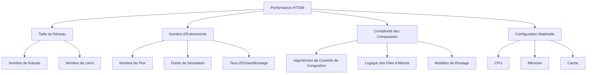

# Optimisation des Performances

## Introduction

HTSIM est conçu pour être un simulateur réseau haute performance, mais les simulations à grande échelle ou complexes peuvent nécessiter une optimisation supplémentaire. Ce document présente des stratégies et techniques pour améliorer les performances de vos simulations HTSIM, permettant de simuler des réseaux plus grands et plus complexes dans un temps raisonnable.

## Comprendre les Facteurs de Performance

Avant d'optimiser, il est important de comprendre les facteurs qui influencent les performances de HTSIM :



### Métriques de Performance Clés

| Métrique | Description | Impact |
|----------|-------------|--------|
| **Temps d'exécution** | Temps total pour compléter la simulation | Mesure directe de la performance |
| **Événements par seconde** | Nombre d'événements traités par seconde | Indicateur de l'efficacité de traitement |
| **Utilisation mémoire** | Mémoire maximale utilisée | Limite pour la taille des simulations |
| **Évolutivité** | Comment la performance évolue avec la taille | Détermine la faisabilité de simulations complexes |

## Optimisations de Compilation

### Options de Compilation Optimisées

Le choix des options de compilation peut considérablement améliorer les performances :

```makefile
# Optimisations agressives
CFLAGS = -O3 -march=native -flto

# Optimisations pour des machines spécifiques
# Pour Intel récent
CFLAGS += -mtune=intel

# Pour AMD récent
CFLAGS += -mtune=znver3

# Utiliser la vectorisation
CFLAGS += -ftree-vectorize -ffast-math
```

Pour appliquer ces optimisations, modifiez le Makefile de HTSIM :

```bash
# Backup du Makefile original
cp Makefile Makefile.bak

# Modifier le Makefile
sed -i 's/CFLAGS = -O2/CFLAGS = -O3 -march=native -flto/' Makefile

# Recompiler
make clean
make
```

### Profilage et Optimisation Ciblée

Utilisez des outils de profilage pour identifier les goulots d'étranglement :

```bash
# Compiler avec le support de profilage
make clean
make CFLAGS="-O2 -g -pg"

# Exécuter la simulation
./htsim_tcp -topo topology.topo -tm traffic.tm -end 10

# Analyser le profil
gprof ./htsim_tcp gmon.out > profile.txt

# Examiner les résultats
head -n 20 profile.txt  # Voir les fonctions les plus consommatrices
```

## Optimisations d'Exécution

### Paramètres de Contrôle de Mémoire

Ajustez les paramètres liés à la mémoire pour réduire la consommation :

```bash
# Réduire la taille des tampons internes
./htsim_tcp -topo topology.topo -tm traffic.tm -buffer_scale 0.5 -end 10

# Limiter le nombre maximal d'événements en mémoire
./htsim_tcp -topo topology.topo -tm traffic.tm -max_events 1000000 -end 10
```

### Échantillonnage Stratégique

Réduisez la fréquence d'échantillonnage pour diminuer la charge I/O et mémoire :

```bash
# Échantillonnage standard (toutes les 10ms)
./htsim_tcp -topo topology.topo -tm traffic.tm -sample 0.01 -end 100

# Échantillonnage réduit pour simulations longues
./htsim_tcp -topo topology.topo -tm traffic.tm -sample 0.1 -end 1000
```

### Parallélisation

HTSIM est principalement mono-thread, mais vous pouvez paralléliser certains aspects :

```bash
# Exécuter plusieurs simulations en parallèle
for seed in {1..8}; do
    ./htsim_tcp -topo topology.topo -tm traffic.tm -seed $seed -o result_$seed &
done
wait
```

Pour une véritable parallélisation interne (si implémentée) :

```bash
# Utiliser plusieurs threads pour les composants parallélisables
./htsim_tcp -topo topology.topo -tm traffic.tm -threads 4 -end 10
```

## Techniques d'Optimisation Avancées

### 1. Réduction de la Précision

Dans certains cas, réduire la précision peut considérablement améliorer les performances sans impact significatif sur les résultats :

```cpp
// Exemple de modification pour réduire la précision
// Au lieu de:
double precise_calculation = /* calcul complexe */;

// Utiliser:
float faster_calculation = /* calcul complexe simplifié */;
```

### 2. Caching des Calculs

Mettez en cache les résultats de calculs coûteux et répétitifs :

```cpp
// Exemple simple de mise en cache
std::map<uint32_t, double> calculation_cache;

double get_calculated_value(uint32_t key, params...) {
    // Vérifier si la valeur est en cache
    if (calculation_cache.find(key) != calculation_cache.end()) {
        return calculation_cache[key];
    }
    
    // Sinon, calculer et mettre en cache
    double result = /* calcul coûteux */;
    calculation_cache[key] = result;
    return result;
}
```

### 3. Optimisation des Structures de Données

Choisissez les structures de données appropriées pour vos opérations fréquentes :

| Structure | Avantages | Inconvénients | Cas d'usage |
|-----------|-----------|---------------|-------------|
| `std::vector` | Accès indexé rapide, cache-friendly | Insertion/suppression lentes au milieu | Files d'attente FIFO, tampons |
| `std::list` | Insertion/suppression rapides | Accès indexé lent, cache-unfriendly | Files d'attente avec beaucoup de modifications |
| `std::unordered_map` | Recherche rapide par clé | Consommation mémoire | Tables de routage, caches |
| `std::priority_queue` | Extraction prioritaire efficace | Modification limitée | Files d'attente d'événements |

### 4. Simplification des Modèles

Pour les très grandes simulations, simplifiez les modèles non essentiels :

```cpp
// Exemple de simplification d'un modèle TCP
// Au lieu d'un modèle complexe avec tous les mécanismes
class SimplifiedTcpSrc : public TcpSrc {
public:
    // Surcharger seulement les méthodes essentielles
    virtual void receiveACK(const TcpAck& ack) {
        // Modèle AIMD simplifié
        if (ack.is_congestion_signal()) {
            _cwnd *= 0.5;
        } else {
            _cwnd += 1.0 / _cwnd;
        }
        // Omettre les mécanismes secondaires
    }
};
```

## Optimisation par Scénario

### Simulations de Réseaux Datacenter à Grande Échelle

Pour simuler de grands datacenters (1000+ nœuds) :

```bash
# Optimisations pour topologie Fat-Tree à grande échelle
./htsim_tcp -topo fattree.topo -tm selective.tm -simplified_routing -aggregated_nodes -end 10
```

Techniques spécifiques :
- Utiliser un modèle de routage simplifié
- Agréger les nœuds similaires
- Réduire les métriques collectées
- Utiliser un sous-ensemble représentatif du trafic

### Simulations Longues de Stabilité

Pour des simulations longues évaluant la stabilité :

```bash
# Configuration pour simulations longues
./htsim_tcp -topo simple.topo -tm continuous.tm -adaptive_sampling -checkpoint 3600 -end 86400
```

Techniques spécifiques :
- Échantillonnage adaptatif (plus fréquent pendant les périodes d'intérêt)
- Points de contrôle périodiques
- Logging sélectif des métriques critiques seulement

### Simulations avec Nombreux Flux Courts

Pour simuler des environnements avec de nombreux flux courts :

```bash
# Optimisation pour nombreux flux courts
./htsim_tcp -topo topology.topo -tm shortflows.tm -batch_events -flow_aggregation -end 10
```

Techniques spécifiques :
- Traitement par lots des événements similaires
- Agrégation de flux similaires
- Gestion optimisée des files d'événements

## Mesure et Comparaison des Performances

### Benchmarking Systématique

Pour évaluer l'impact de vos optimisations, utilisez un benchmark standardisé :

```bash
#!/bin/bash
# benchmark.sh

# Configuration de base
TOPO="fattree.topo"
TM="all_to_all.tm"
DURATION=10

# Fonction pour exécuter un test et mesurer les performances
run_benchmark() {
    local name=$1
    local cmd=$2
    
    echo "Exécution du benchmark: $name"
    
    # Mesurer le temps d'exécution
    start_time=$(date +%s.%N)
    $cmd > /dev/null
    end_time=$(date +%s.%N)
    
    # Calculer la durée
    duration=$(echo "$end_time - $start_time" | bc)
    
    # Mesurer l'utilisation maximale de mémoire
    mem_usage=$(grep "VmPeak" /proc/$$/status | awk '{print $2}')
    
    echo "$name,$duration,$mem_usage" >> benchmark_results.csv
}

# Entête du fichier de résultats
echo "Benchmark,Durée(s),Mémoire(KB)" > benchmark_results.csv

# Exécuter les différentes configurations
run_benchmark "Base" "./htsim_tcp -topo $TOPO -tm $TM -end $DURATION -o base"
run_benchmark "OptimisationMémoire" "./htsim_tcp -topo $TOPO -tm $TM -end $DURATION -buffer_scale 0.5 -o opt_mem"
run_benchmark "ÉchantillonnageRéduit" "./htsim_tcp -topo $TOPO -tm $TM -end $DURATION -sample 0.1 -o opt_sample"
run_benchmark "ModèleSimplifié" "./htsim_tcp -topo $TOPO -tm $TM -end $DURATION -simplified -o opt_model"

# Afficher les résultats
echo "Résultats du benchmark:"
cat benchmark_results.csv | column -t -s ','
```

### Visualisation des Améliorations

Utilisez un script Python pour visualiser l'impact des optimisations :

```python
#!/usr/bin/env python3
import pandas as pd
import matplotlib.pyplot as plt
import numpy as np

# Charger les résultats du benchmark
results = pd.read_csv('benchmark_results.csv')

# Normaliser par rapport à la base
base_duration = results.loc[results['Benchmark'] == 'Base', 'Durée(s)'].values[0]
base_memory = results.loc[results['Benchmark'] == 'Base', 'Mémoire(KB)'].values[0]

results['Durée_Normalisée'] = results['Durée(s)'] / base_duration
results['Mémoire_Normalisée'] = results['Mémoire(KB)'] / base_memory

# Créer un graphique à barres pour les comparaisons
fig, ax = plt.subplots(figsize=(10, 6))

# Position des barres
x = np.arange(len(results['Benchmark']))
width = 0.35

# Tracer les barres
ax.bar(x - width/2, results['Durée_Normalisée'], width, label='Temps d\'exécution')
ax.bar(x + width/2, results['Mémoire_Normalisée'], width, label='Utilisation mémoire')

# Ajouter les étiquettes, le titre et la légende
ax.set_xlabel('Configuration')
ax.set_ylabel('Valeur normalisée (plus petit = meilleur)')
ax.set_title('Impact des Optimisations sur les Performances')
ax.set_xticks(x)
ax.set_xticklabels(results['Benchmark'])
ax.legend()

plt.grid(axis='y', linestyle='--', alpha=0.7)
plt.savefig('optimization_impact.png')
plt.show()
```

## Optimisations Matérielles

### Configuration Matérielle Recommandée

Pour des performances optimales avec HTSIM :

| Composant | Recommandation | Impact |
|-----------|----------------|--------|
| **CPU** | Haute fréquence, nombreux cœurs | Accélère le traitement d'événements |
| **Mémoire** | Grande capacité, haute bande passante | Permet des simulations plus grandes |
| **Stockage** | SSD rapide | Améliore le chargement des configurations et l'enregistrement des résultats |
| **Cache** | Grande taille | Réduit les accès mémoire lents |

### Configuration du Système d'Exploitation

Optimisez votre système d'exploitation pour les simulations :

```bash
# Augmenter la limite de fichiers ouverts
ulimit -n 65536

# Augmenter la taille maximale de pile
ulimit -s unlimited

# Désactiver le swapping pour les simulations critiques
sudo swapoff -a

# Optimiser les paramètres noyau pour les applications à usage intensif de mémoire
sudo sysctl -w vm.swappiness=10
sudo sysctl -w vm.dirty_ratio=80
sudo sysctl -w vm.dirty_background_ratio=5
```

## Bonnes Pratiques

1. **Profilage avant optimisation** : Identifiez les vrais goulots d'étranglement avant d'optimiser

2. **Approche progressive** : Testez chaque optimisation individuellement pour mesurer son impact

3. **Validation des résultats** : Vérifiez que les optimisations ne compromettent pas la précision des résultats

4. **Documentation** : Documentez toutes les modifications d'optimisation pour la reproductibilité

5. **Optimisations spécifiques au scénario** : Adaptez vos optimisations au type de simulation que vous exécutez

6. **Équilibre** : Trouvez le bon équilibre entre performance et précision/détail de la simulation

## Limites et Compromis

Soyez conscient des compromis inhérents à chaque optimisation :

| Optimisation | Avantage | Compromis Potentiel |
|--------------|----------|---------------------|
| Réduction précision | Performance accrue | Perte de précision dans certains scénarios |
| Échantillonnage réduit | Moins de données à traiter | Granularité temporelle réduite |
| Simplification modèles | Simulation plus rapide | Comportements subtils potentiellement perdus |
| Agrégation nœuds | Permet des réseaux plus grands | Perte de visibilité au niveau individuel |

## Conclusion

L'optimisation des performances est un aspect essentiel pour tirer le meilleur parti de HTSIM, particulièrement pour les simulations à grande échelle ou longue durée. En comprenant les facteurs qui influencent les performances et en appliquant les techniques appropriées, vous pouvez considérablement améliorer l'efficacité de vos simulations tout en maintenant la précision nécessaire pour vos objectifs de recherche ou d'analyse.

N'oubliez pas que l'optimisation doit toujours être guidée par des mesures concrètes et que les compromis entre performance et précision doivent être soigneusement évalués en fonction de vos besoins spécifiques.
